# Clauday

> **두레이(Dooray) × Claude Code**, 한 창에 묶은 사내 오픈소스 AI 업무 비서

매일 두레이 태스크 확인하고, 메신저 훑고, 보고서 쓰고, 터미널에서 Claude Code 돌리는 게 반복되길래
"그냥 한 앱에서 다 되면 안 되나?" 싶어서 만든 Electron 앱입니다.
혼자 쓰기 아까워서 풀어요. 같이 쓰고 같이 개선해요. 🙂

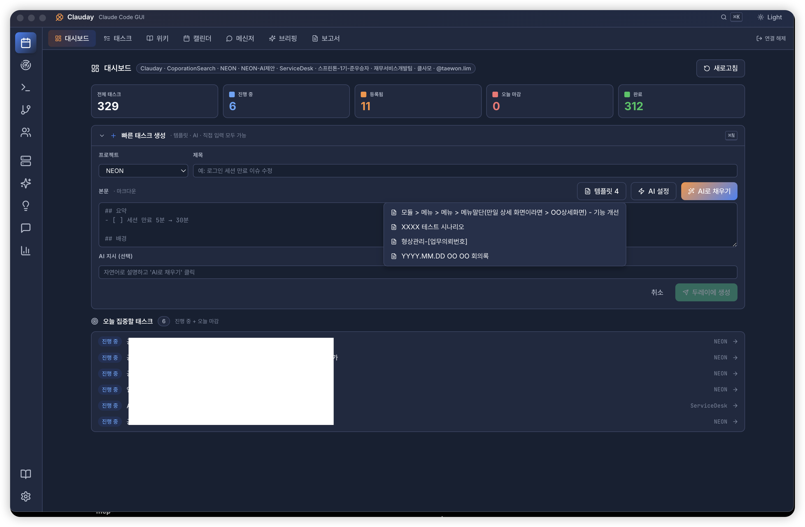

---

## 세 줄 요약

- 두레이(태스크·위키·캘린더·메신저·보고서)와 Claude Code를 한 Electron 앱에서 씁니다.
- 반복 업무는 AI가 요약·작성·스캔·정리해줍니다. 기능별로 **Haiku / Sonnet / Opus** 자동 라우팅.
- 스킬·MCP·와처·세션을 GUI로 관리하고 팀에 공유할 수 있어요.

## 목차

1. [대시보드](#1-대시보드--오늘-할-일을-한-눈에)
2. [태스크 · 프로젝트 사이드바](#2-태스크--프로젝트-사이드바)
3. [위키 AI 분석](#3-위키--ai-구조-분석)
4. [캘린더 AI 분석](#4-캘린더--ai-일정-분석)
5. [메신저 · AI 설정](#5-메신저--ai-대화-요약--작성)
6. [AI 브리핑](#6-ai-브리핑--아침에-한-번)
7. [업무 보고서](#7-보고서--일일주간-업무-보고)
8. [메신저 스캔 · 와처](#8-메신저-스캔--와처)
9. [Claude Code 터미널](#9-claude-code-터미널)
10. [브랜치 병렬 작업](#10-브랜치-병렬-작업)
11. [MCP 서버 관리](#11-mcp-서버-관리)
12. [Skills · AI 추천](#12-skills--ai-추천)
13. [세션 탐색기](#13-세션-탐색기)
14. [사용량 대시보드](#14-사용량-대시보드--비용-투명하게)
15. [기능별 AI 모델](#15-기능별-ai-모델--자동-라우팅)
16. [커뮤니티](#16-커뮤니티)
17. [설치 & 개발](#설치--개발)
18. [릴리즈](#릴리즈)
19. [로드맵](#로드맵)
20. [기여하기](#기여하기)

---

## 1. 대시보드 — 오늘 할 일을 한 눈에

앱을 열면 가장 먼저 보이는 화면입니다. 받은 태스크가 수백 개라도 오늘 봐야 할 것만 추려서 맨 위에 띄웁니다.
"빠른 태스크 생성" 박스에 제목만 치면 담당자·마일스톤·태그는 AI가 채워요.


- **빠른 태스크 생성** — 제목만 입력 → 나머지 필드는 AI가 추론
- **오늘 집중 태스크** — 마감 임박 / 내가 담당 / 진행 중 기준으로 자동 정렬
- **통계 배너** — 전체 / 오늘 / 진행 / 지연 / 완료를 한 줄에

---

## 2. 태스크 · 프로젝트 사이드바

좌측 프로젝트 사이드바에서 프로젝트를 고르면 해당 프로젝트 태스크만 보입니다.
두레이 웹을 여러 탭 띄워두던 습관이 그냥 없어져요.

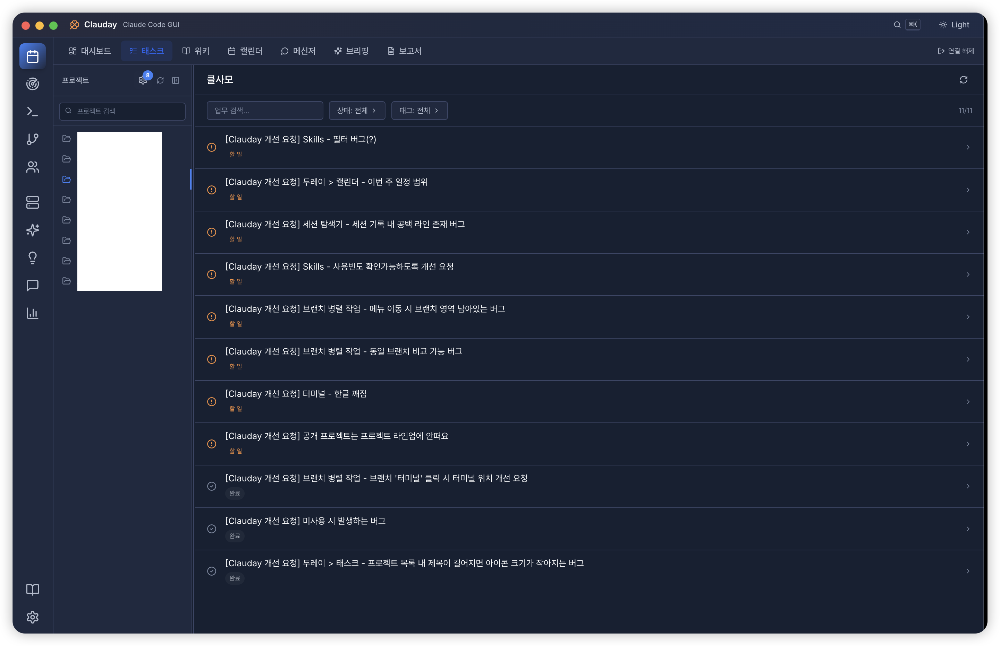

- **프로젝트별 필터** — 사이드바 클릭 한 번으로 해당 프로젝트 태스크만
- **상태 · 담당자 · 마일스톤** 기본 필터 — Dooray API와 1:1 호환
- **인라인 편집** — 목록에서 바로 상태/담당자 수정

---

## 3. 위키 — AI 구조 분석

프로젝트 위키를 트리로 펼치면서, AI가 "이 위키 중복이에요", "이 카테고리 문서가 비어 있어요" 같은 걸 알려줍니다.
신규 입사자용 온보딩 맵도 버튼 하나로 뽑을 수 있어요.

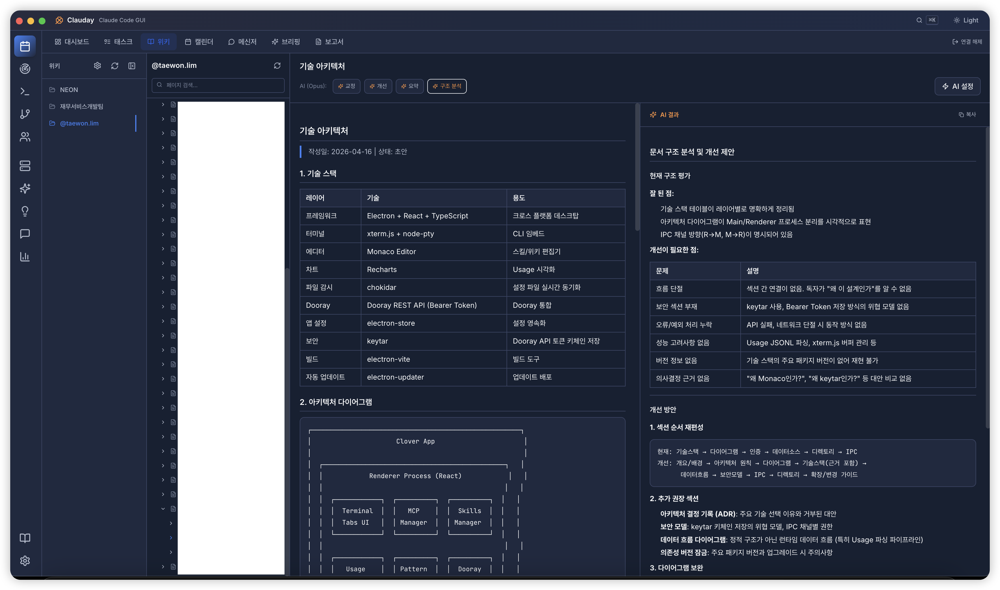

- **커스텀 순서** — 위키 트리 드래그로 직접 정렬
- **AI 구조 분석** — 중복 / 결락 / 고아 문서 리포트
- **AI 요약** — 긴 문서 상단에 TL;DR 자동 삽입

---

## 4. 캘린더 — AI 일정 분석

단순 뷰어가 아니라 "오늘 3시간 공백이에요", "화요일 회의 7개 — 번아웃 주의", "15~18시 연속 회의" 같은 분석을 자동으로 넣어줍니다.
빈 시간 자동 추천은 생각보다 많이 쓰게 됩니다.

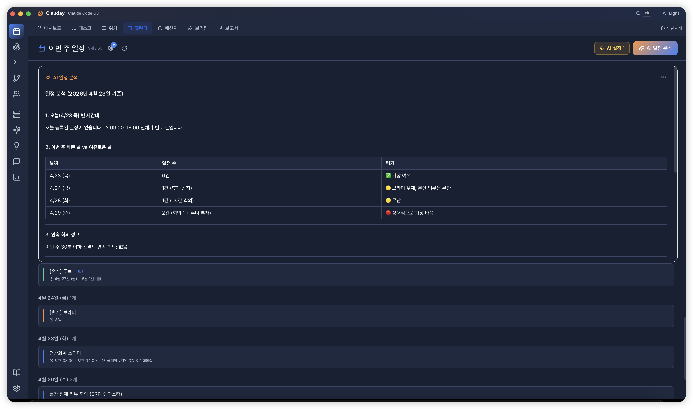

- **빈 시간 찾기** — 당일 공백 블록을 AI가 추천
- **바쁜 날 경고** — 회의 4개 이상이면 경고 배지
- **연속 회의 탐지** — 이동/휴식 없는 일정을 분리 제안

---

## 5. 메신저 — AI 대화 요약 & 작성

수십 개 채널 다 읽는 건 현실적으로 불가능하잖아요. 놓친 멘션/질문을 추려주고,
"회식 장소 추천" 같은 주제가 뜨면 발언자·후보·결론을 표로 정리합니다.

작성 쪽은 **에이전틱 웹 조사 모드**로 동작해요. "다음 주 점심 장소 추천해줘" 같은 요청에
AI가 `WebSearch` / `WebFetch`로 직접 외부 사실을 조사한 뒤 메시지에 반영합니다.

| 채널 목록 · AI 설정 | 대화 주제 자동 정리 | AI 설정 모달 |
|---|---|---|
| 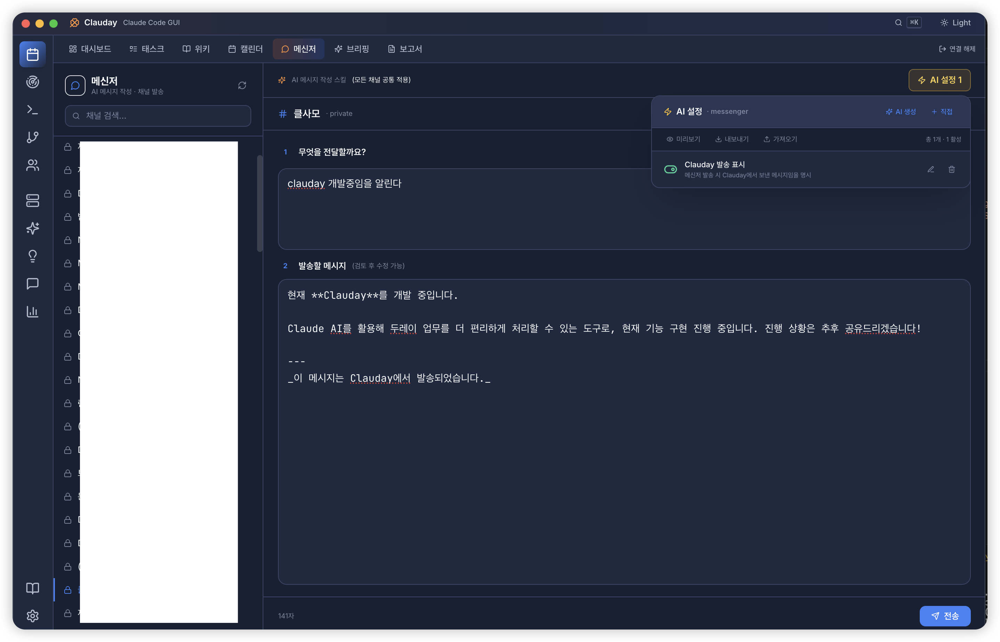 | 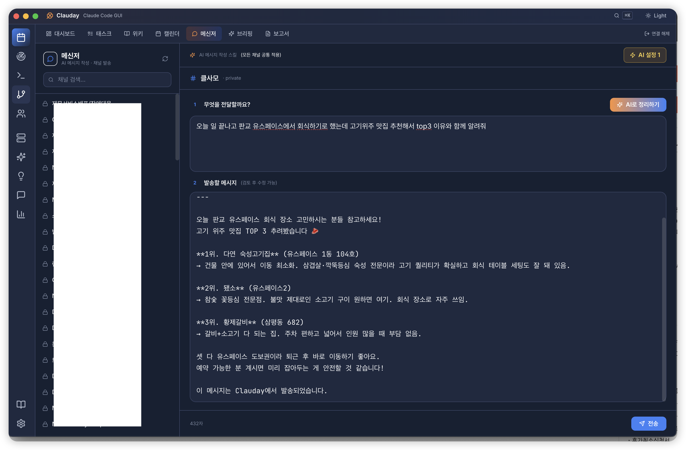 | 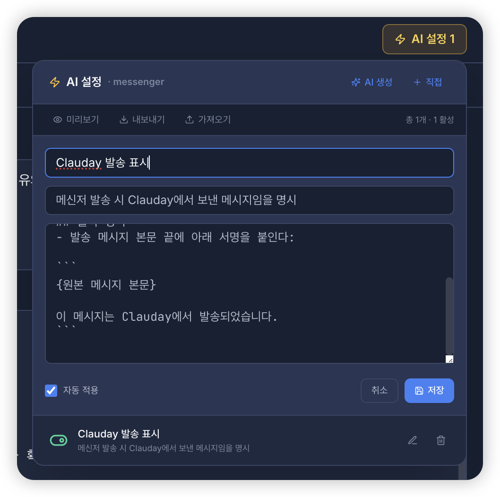 |

> **Clauday 발송 배지** — AI가 대신 보낸 메시지에는 "Clauday 발송" 태그가 붙습니다.
> 팀원에게 투명하게 보이도록 일부러 숨기지 않았어요.

---

## 6. AI 브리핑 — 아침에 한 번

태스크·캘린더·메신저·위키·MCP 소스를 모아서 "오늘의 브리핑"을 생성합니다.
로컬 파일시스템에 저장되어 지난 브리핑을 다시 꺼내볼 수 있어요 (탭 이동해도 날아가지 않음).

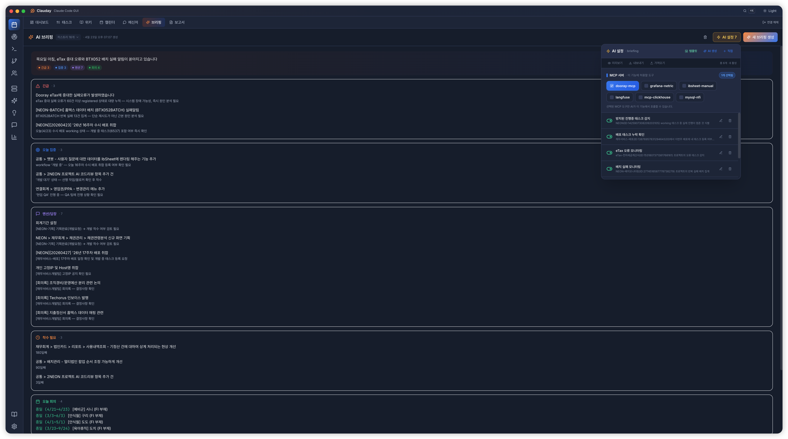

- **히스토리 저장** — 로컬 파일로 보관
- **MCP 연결** — Grafana · MySQL · ClickHouse · ibsheet-manual 등 추가
- **모델 선택** — 빠른 요약은 Haiku, 주간 요약은 Sonnet

---

## 7. 보고서 — 일일/주간 업무 보고

오늘 완료한 태스크, 댓글 활동, 커밋, 메신저 발언을 엮어 일일 보고서 초안을 만듭니다.
그대로 쓰거나 톤 조절/재작성 해서 사용, 퇴근 전에 한 번 클릭하고 나가면 끝.

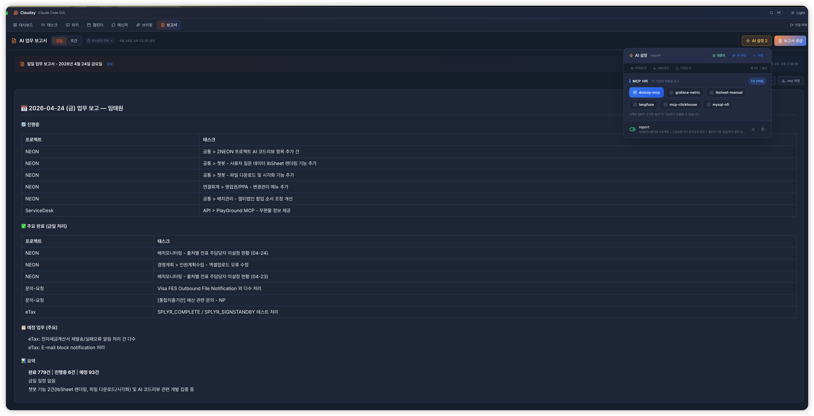

**플로우**: 소스 선택(태스크/위키/메신저/캘린더) → AI 초안 생성(Sonnet) → Dooray 메신저/위키/태스크 중 원하는 곳으로 공유

---

## 8. 메신저 스캔 · 와처

"놓친 게 있는지" 한 번 훑어주는 스캔 탭과, "이런 거 뜨면 알려줘"를 자연어로 등록하는 와처가 있습니다.
"CS 채널에서 장애 키워드 뜨면 알려줘" 같은 문장을 입력하면 AI가 필터 규칙으로 변환합니다.

| 더 확인이 필요한 대화 | 와처 생성 (자연어 → 필터) |
|---|---|
| 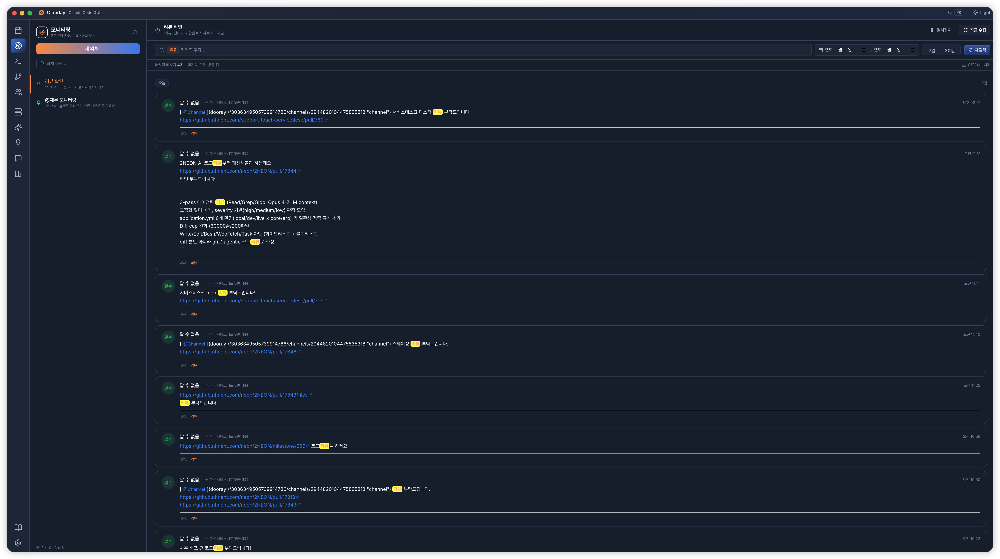 | 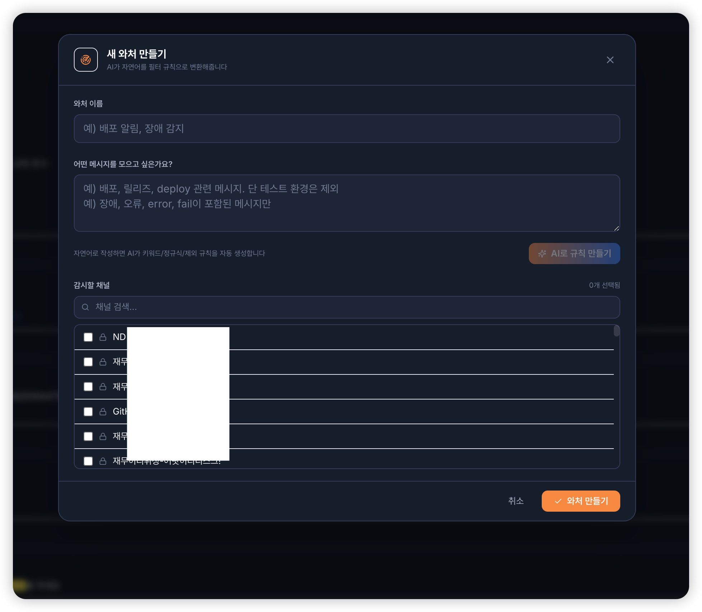 |

---

## 9. Claude Code 터미널

앱 안에서 바로 Claude Code를 돌립니다. 폴더 선택해서 탭을 열고,
<kbd>Cmd</kbd>+<kbd>T</kbd> / <kbd>Cmd</kbd>+<kbd>W</kbd> 로 새 탭·닫기.
Claude Code 전용만 있는 게 아니라 그냥 쉘 탭으로도 쓸 수 있어요.

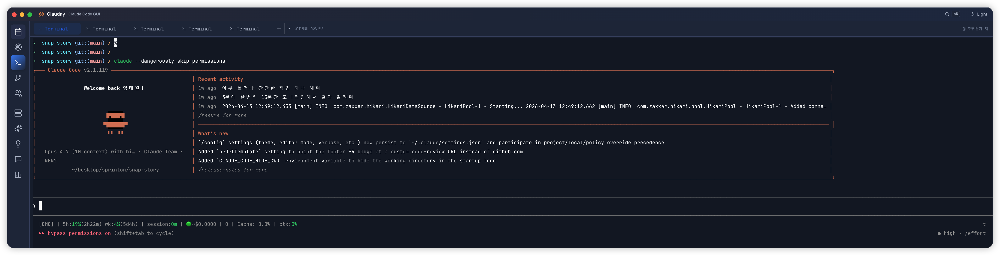

- **폴더 선택** — 탭마다 서로 다른 프로젝트 루트
- **다중 탭** + **일반 쉘 겸용**
- **세션 저장** — 각 탭의 대화 기록은 세션 탐색기에서 다시 열기 가능

---

## 10. 브랜치 병렬 작업

워크트리를 자동 분리해 브랜치별로 독립된 Claude Code 세션을 돌립니다.
"이 브랜치는 리팩터, 저 브랜치는 버그 픽스"를 동시에 맡기고 결과만 받아볼 수 있어요.

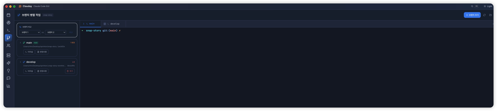

- **워크트리 자동 분리** — 브랜치마다 별도 작업 폴더
- **동시 실행** — 동일 레포의 두 브랜치 작업을 충돌 없이
- **진행 현황 모니터링** + **결과 비교**

---

## 11. MCP 서버 관리

Dooray · Grafana · ClickHouse · MySQL · ibsheet-manual 같은 MCP 서버를 GUI에서 추가 / 토글 / 편집합니다.
Claude Code CLI 설정 파일을 직접 만질 필요 없어서 팀원 온보딩이 훨씬 빨라요.

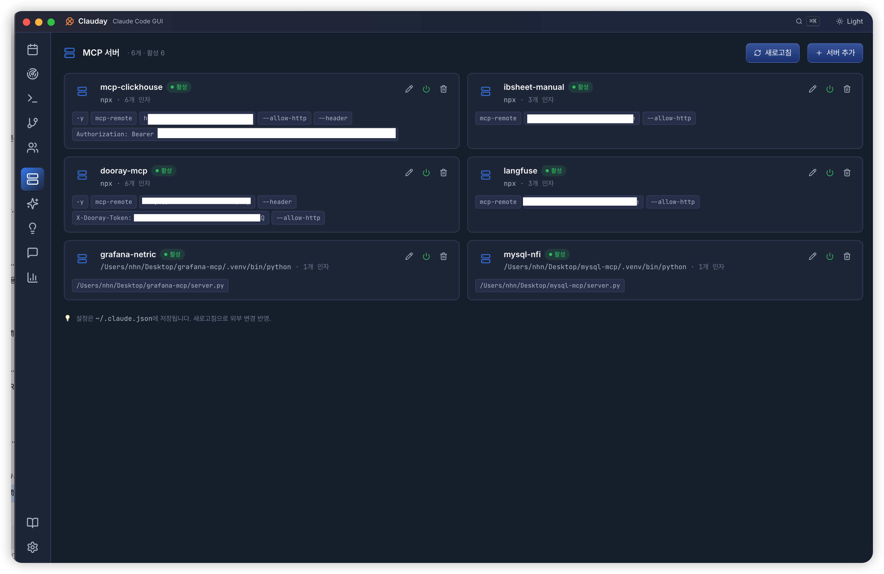

---

## 12. Skills · AI 추천

자주 쓰는 Claude Code 스킬(프롬프트 템플릿 + 도구)을 한 곳에서 관리하고 팀원과 공유합니다.
현재 작업 컨텍스트를 AI가 읽고 쓰기 좋은 스킬을 3~5개 먼저 제안해줘요.

| 스킬 라이브러리 | 스킬 공유 | AI 추천 | 추천 상세 |
|---|---|---|---|
| 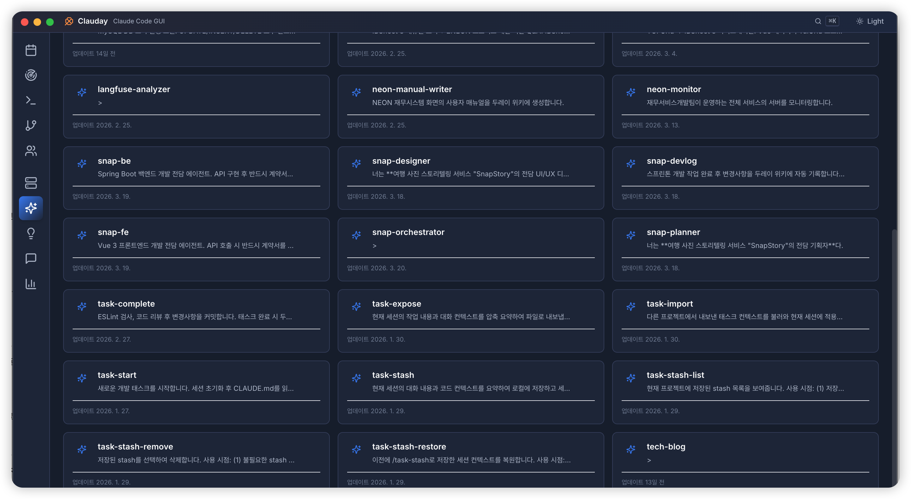 | 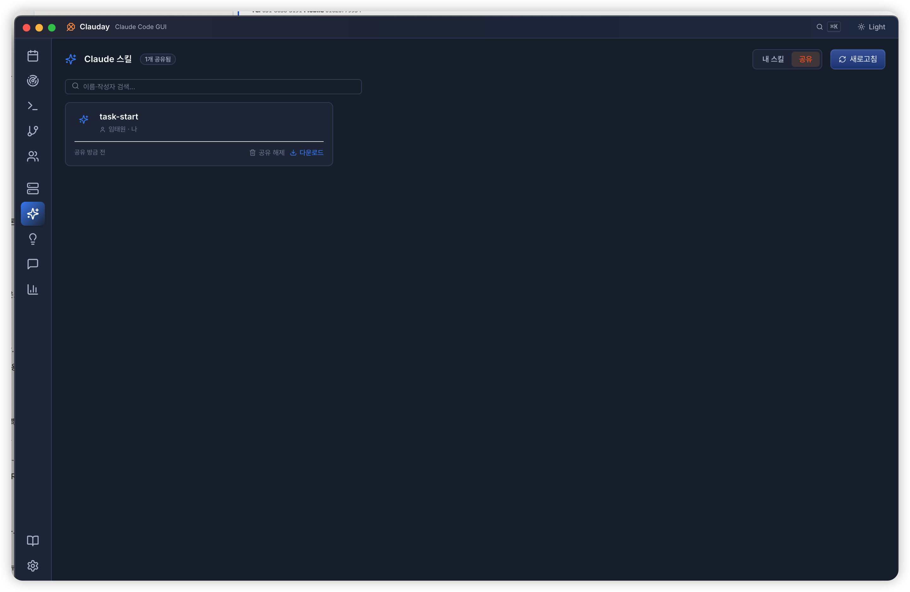 | 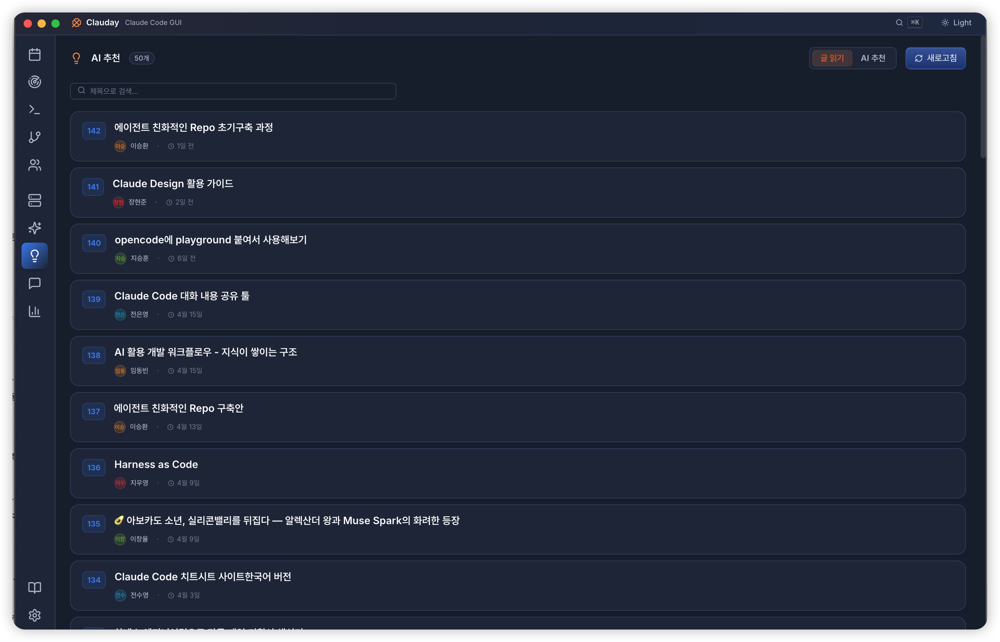 | 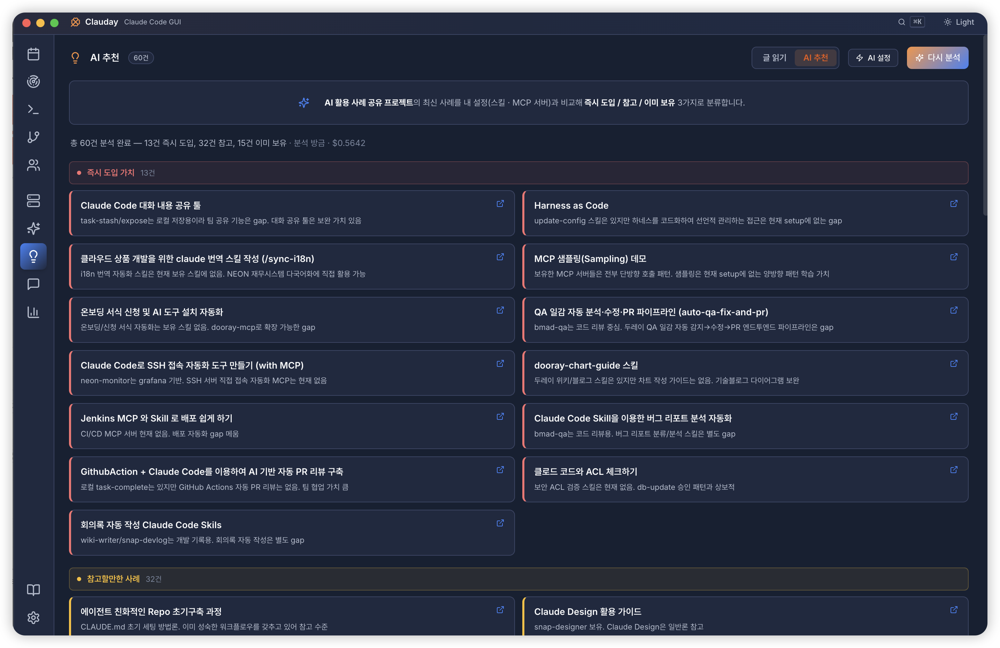 |

- 내가 만든 스킬 + 팀 공유 스킬 + 공식 스킬
- 링크로 공유 → 원클릭 설치
- 실행 전 프롬프트/도구/예상 효과 미리보기

---

## 13. 세션 탐색기

Claude Code 세션(JSONL)을 읽어 프로젝트·날짜·키워드로 검색합니다.
"지난주에 이 문제 어떻게 풀었더라?" 싶을 때 그 대화를 찾아 이어서 쓸 수 있어요.

| 프로젝트별 세션 | 본문 풀텍스트 검색 |
|---|---|
| 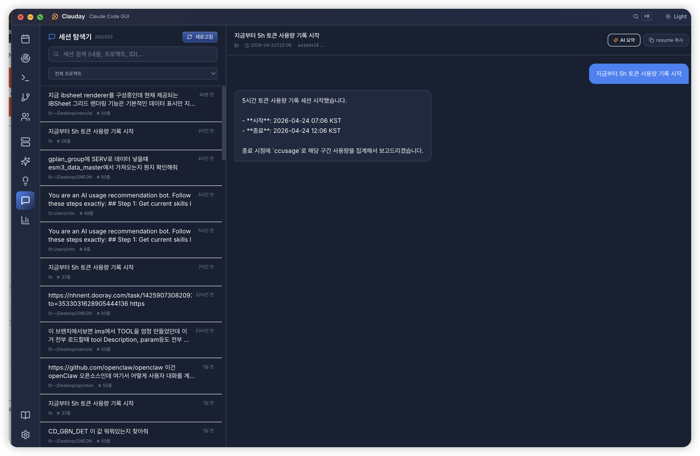 | 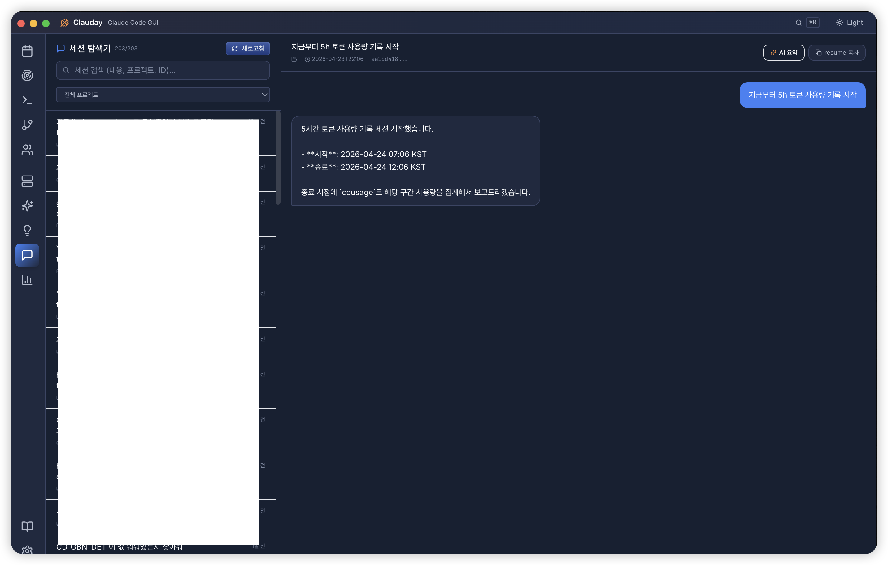 |

---

## 14. 사용량 대시보드 — 비용 투명하게

개인용이든 팀용이든 AI 쓰는 만큼 비용이 나가니까 눈에 보여야겠더라구요.
모델별 사용량 · 일자별 비용 · 프로젝트별 소비를 한 장으로 봅니다.

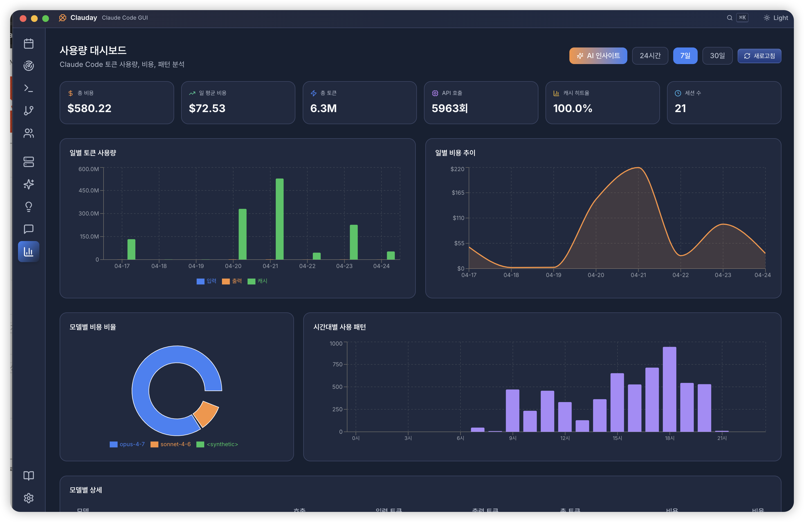

---

## 15. 기능별 AI 모델 — 자동 라우팅

모델 매번 고르는 게 귀찮아서 기능별로 기본 모델을 정해뒀습니다. 설정에서 바꿀 수 있어요.

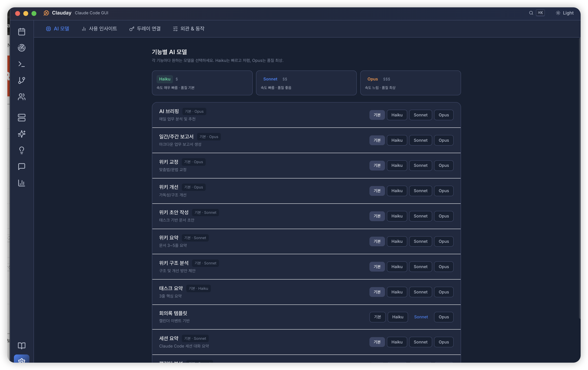

| 기능 | 용도 | 모델 |
|---|---|---|
| 메신저 요약 · 빠른 태스크 생성 | 짧은 문장, 제목·태그 자동 채우기 | **Haiku** |
| AI 브리핑 · 보고서 · 위키 분석 · 메신저 작성 | 여러 소스 통합, 구조화된 결과물 | **Sonnet** |
| AI 추천 · Claude Code 설계 / 리팩터링 | 복잡한 설계·추론 | **Opus** |

---

## 16. 커뮤니티

각자 만든 스킬 · MCP 설정 · 와처 규칙 · 프롬프트 템플릿을 사내에 공유하는 공간.
같은 회사인데 같은 삽질을 열 명이 하는 건 좀 아깝잖아요.

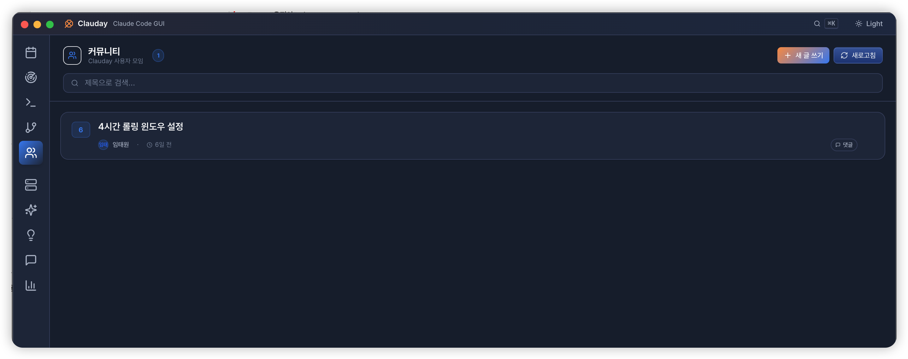

---

## 설치 & 개발

### 요구사항

- Node.js 20+
- Python 3.11 (node-gyp 호환)
- macOS / Windows
- Claude Code CLI가 설치되어 있고 로그인된 상태

### 개발 서버

```bash
npm install
npm run dev
```

### 빌드

```bash
npm run dist       # macOS dmg
npm run dist:win   # Windows exe
npm run dist:all   # macOS + Windows
```

빌드 결과물은 `release/` 디렉터리에 생성됩니다.

---

## 릴리즈

릴리즈는 **태그 푸시 트리거**입니다. main에 머지만 해서는 릴리즈가 나가지 않아요.

```bash
# 버전 올리고 태그 푸시
git tag v1.2.1
git push origin v1.2.1
```

그러면 `.github/workflows/release.yml`이 돌면서:

- macOS (dmg, zip) 빌드 → GitHub Release에 자동 업로드
- Windows (exe) 빌드 → GitHub Release에 자동 업로드
- 릴리즈 노트 자동 생성

수동 실행도 가능합니다: GitHub → Actions → Release → **Run workflow**.

> Apple Developer 인증서 시크릿(`MAC_CSC_LINK`, `APPLE_ID` 등)이 등록되어 있으면 자동 서명, 없으면 unsigned dmg가 나옵니다.

---

## 로드맵

대략 이렇게 키워 나갈 예정입니다. 우선순위는 피드백 받으면서 조정할게요.

- **Phase 1 · AI 업무 대시보드** `작업 중` — 태스크 요약, 자연어 관리, 스마트 알림
- **Phase 2 · AI 업무 보고** — 일일/주간 보고서, 위키 자동화, 회의록
- **Phase 3 · Claude Code 통합** — 태스크 ↔ 코드 브릿지, AI 코드리뷰 → 코멘트
- **Phase 4 · 팀 인사이트** — 워크로드 시각화, 프로젝트 건강도, 스프린트 리포트

---

## 기여하기

사내 오픈소스입니다. 혼자 만든 거라 버그도 많고, 쓰다 보면 "이거 왜 이렇게 돼?" 하는 부분도 분명 있을 거예요.
작은 거라도 편하게 얘기해 주세요.

**이렇게 도와주시면 좋아요**

- 써보고 "여긴 이래서 불편하다" 한 줄 피드백
- 자기 팀 업무 패턴을 스킬/와처로 만들어 커뮤니티에 공유
- "이 기능도 있으면 좋겠다" 제안 (이슈/메신저 모두 OK)
- 버그 리포트 — 재현 경로 + 스크린샷이면 충분합니다
- PR 환영. 커밋 단위 작게 쪼개서 주시면 리뷰 빠르게 할게요

문의 · 제보 · taewon.lim@nhndooray.com

---

## License

MIT
