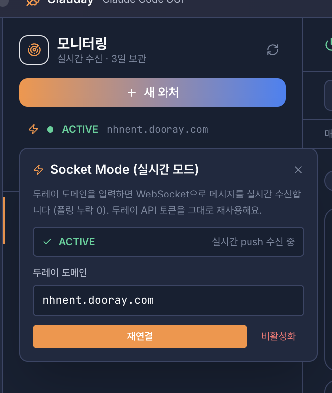
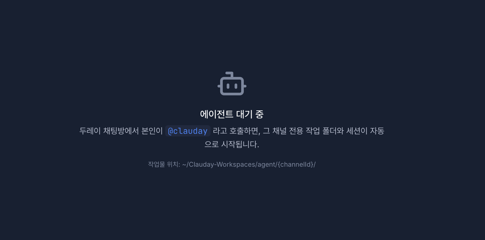
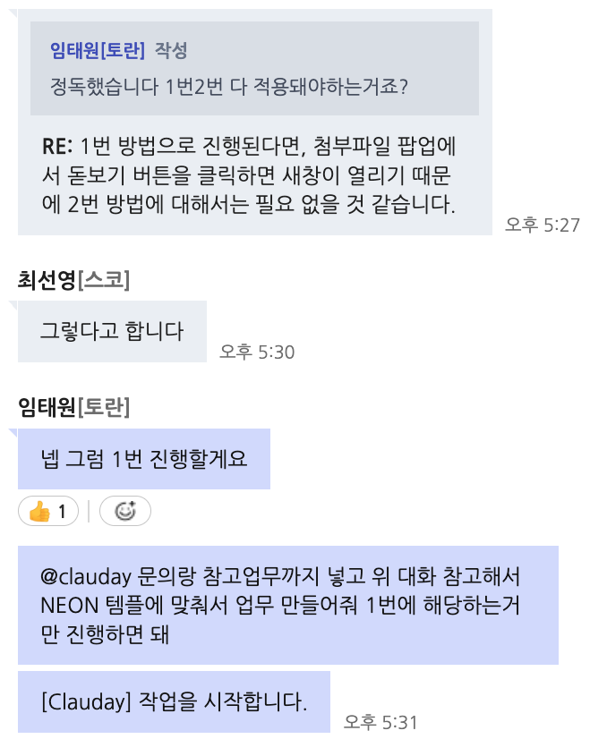
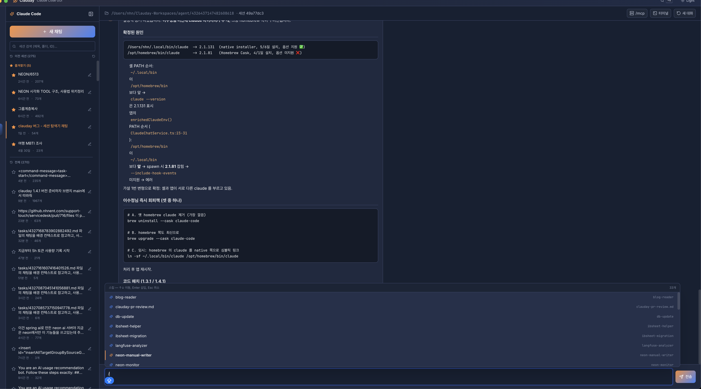
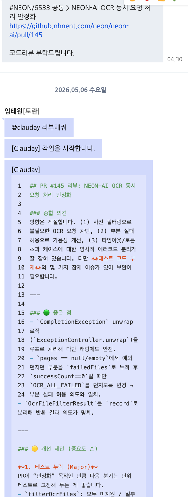
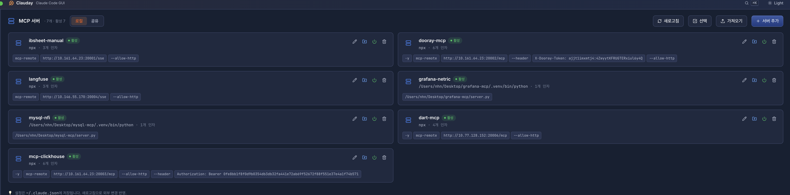
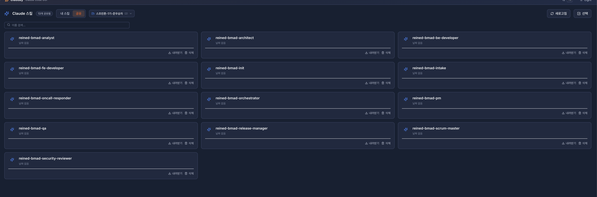

# Clauday

> **두레이(Dooray) × Claude Code**, 한 창에 묶은 사내 오픈소스 AI 업무 비서

매일 두레이 태스크 확인하고, 메신저 훑고, 보고서 쓰고, 터미널에서 Claude Code 돌리는 게 반복되길래
"그냥 한 앱에서 다 되면 안 되나?" 싶어서 만든 Electron 앱입니다.
혼자 쓰기 아까워서 풀어요. 같이 쓰고 같이 개선해요. 🙂


---

## 세 줄 요약

- 두레이(태스크·위키·캘린더·메신저·보고서)와 Claude Code를 한 Electron 앱에서 씁니다.
- 반복 업무는 AI가 요약·작성·스캔·정리해줍니다. 기능별로 **Haiku / Sonnet / Opus** 자동 라우팅.
- 스킬·MCP·와처·세션을 GUI로 관리하고, **두레이 메신저에서 `@clauday`만 불러도 봇이 일을 시작**합니다 (Socket Mode 실시간 / 팀 공유 라이브러리).

## 목차

1. [대시보드](#1-대시보드)
2. [태스크](#2-태스크)
3. [위키](#3-위키)
4. [캘린더](#4-캘린더)
5. [메신저](#5-메신저)
6. [AI 브리핑](#6-ai-브리핑)
7. [보고서](#7-보고서)
8. [메신저 스캔 · 와처 (Socket Mode)](#8-메신저-스캔--와처-socket-mode)
9. [Claude Code 터미널](#9-claude-code-터미널)
10. [브랜치 병렬 작업](#10-브랜치-병렬-작업)
11. [MCP 서버 관리](#11-mcp-서버-관리)
12. [Skills 관리](#12-skills-관리)
13. [세션 탐색기](#13-세션-탐색기)
14. [사용량 대시보드](#14-사용량-대시보드)
15. [AI 추천](#15-ai-추천)
16. [커뮤니티](#16-커뮤니티)
17. [@clauday 에이전트 (두레이 봇 모드)](#17-clauday-에이전트-두레이-봇-모드) `v1.4 NEW`
18. [팀 공유 라이브러리 (MCP · Skills)](#18-팀-공유-라이브러리-mcp--skills) `v1.4.1 NEW`
19. [부록 · 기능별 AI 모델 라우팅](#부록--기능별-ai-모델-라우팅)
20. [설치 & 개발](#설치--개발)
21. [릴리즈](#릴리즈)
22. [로드맵](#로드맵)
23. [기여하기](#기여하기)

---

## 1. 대시보드

제가 개발을 담당한 프로젝트가 여럿 퍼져 있다 보니,
**"이 프로젝트에서 내가 지금까지 완료한 태스크가 총 몇 개지?"** 같은 걸 한 눈에 보고 싶었어요.
두레이로는 매번 프로젝트 들어가서 필터 걸어야 해서 번거로웠거든요.

또 하나 큰 목적은 **개발 태스크 생성**이에요.
프로젝트·템플릿을 미리 만들어 두고, AI 설정에 "나는 이런 식으로 태스크를 쓴다"는 내 요구사항을 넣어 두면,
"~~ 이유 때문에 만들어"라고 한 줄만 던져도 AI가 템플릿에 맞춰 채워줍니다.
태스크 하나 만드는 데 드는 품을 줄이고 싶었어요.

그리고 마지막으로 **진행해야 할 태스크**도 이 화면에서 바로 봅니다.


- **프로젝트별 완료 태스크 수 집계**
- **AI 빠른 태스크 생성** — 프로젝트/템플릿 + 내 요구사항(프롬프트) + 한 줄 입력 → 필드 자동 채움
- **태그 지원** — 그룹별 chip + AI 추천 (필수 태그 누락 방지) (v1.4.1)
- **오늘 집중 태스크**
- **자동 동기화** — 1/5/15/30분 주기 선택 가능 (v1.4.1)
- **반응형 레이아웃** — 좁은 폭에서 stat card 자동 stack (v1.4.1)

---

## 2. 태스크

솔직히 이건 대시보드 만들고 나니 그냥 태스크 화면도 있어야 할 것 같아서 붙였습니다.
근데 기존 두레이랑 다르게 **몇 가지를 제 취향에 맞게 바꿨어요.**

**GitHub 훅 댓글 제외** — 저희 프로젝트는 GitHub hook으로 커밋·PR 내용이 태스크 댓글에 전부 쌓여요.
그러다 보니 개발 승인 코멘트나 현업 배포 확인 댓글을 찾기 어렵더라구요.
그래서 GitHub 훅 댓글은 숨길 수 있게 했습니다.

**완료 분리 + 시간순 정렬** — 두레이 기본 정렬은 "최근 업데이트 순"이라 완료된 태스크가 위에 올라와서 시야를 어지럽히곤 합니다.
Clauday에서는 **완료 / 미완료를 먼저 분리**하고, 그 안에서 시간순으로 정렬합니다. "지금 해야 할 일"이 항상 위에 와요.

**특정 프로젝트만 보기** — 개발업무를 다루는 프로젝트만 설정하여 볼 수 있게하고,
**두레이 웹으로 이동하는 버튼**도 달아서 상세 편집은 두레이에서 바로 이어갈 수 있게 했습니다.


---

## 3. 위키

**프로젝트별 필터** — 작성된 위키를 프로젝트 단위로만 보고 싶어서 필터를 붙였습니다.

그리고 **위키가 길면 보기 귀찮잖아요.**
간단 요약 / 구조 분석 / 문장 교정 / 개선 제안 같은 AI 기능을 GUI로 바로 쓸 수 있게 했어요.
CLI로 프롬프트 칠 필요 없이, 위키 열고 버튼 하나로.


- **프로젝트별 위키 필터**
- **간단 요약** · **구조 분석** · **교정** · **개선 제안** 원클릭

---

## 4. 캘린더

저는 회의가 많지 않은 편이라 이건 사실 **회의 많은 분들한테 더 잘 맞을 것 같습니다.**
설정한 캘린더의 일정을 가져와서 보여주고, **그 일정을 기반으로 AI가 분석**을 해줘요.
"오늘 공백 몇 시간", "이번 주 너무 빡빡함", "연속 회의 구간" 같은 것들.


- 선택한 캘린더 일정만 로드
- AI 기반 하루/주간 일정 분석
- 빈 시간 · 과밀 · 연속 회의 감지

---

## 5. 메신저

단체 채팅방에서 **"뭐 조사해서 답 보내야 하는" 상황**, 꽤 많지 않나요?
맛집 추천, 일정 맞추기, 자료 링크 정리 같은 것들이요.

Clauday 메신저는 **웹서치 기반 AI 에이전트**로
"이번 주 금요일 저녁 회식 장소 추천해줘 — 강남역 근처, 10명 수용, 룸 있는 곳으로" 같은 요청을 그대로 넣으면
`WebSearch` / `WebFetch`로 스스로 조사한 뒤 메시지에 녹여서 초안을 만들어 줍니다.

거기에 **맞춤법 교정 / 정중한 표현으로 다듬기** 같은 기능을 원한다면 AI설정을 통해
말실수하기 쉬운 단체방에서 한 번 AI로 거르고 보낼 수 있게 했어요.

| 웹 조사 + 대화 정리 | AI 설정 모달 |
|---|---|
|  |  |


---

## 6. AI 브리핑

여기저기 퍼져 있는 정보 — **오늘 내가 뭘 해야 하는지 / 누가 나를 멘션했는지 / 어떤 일정을 검토해야 하는지 / 급한 건 뭔지** —
를 하루 시작할 때 한 번에 파악하고 싶었습니다.

태스크·캘린더·메신저·위키·MCP 데이터를 한 번에 긁어서 오늘 아침용 브리핑을 만들어 줍니다.
퍼져 있던 걸 **한 장으로 모으는** 게 핵심이에요.


- 오늘 할 일 / 멘션 / 일정 / 급한 이슈를 한 번에
- 로컬 파일로 저장 — 지난 브리핑 다시 보기 가능
- MCP 서버 연결로 외부 데이터까지 포함

---

## 7. 보고서

브리핑이랑 꽤 겹치는데, 이쪽은 **보고서 형식에 맞춰 정리되고 주간 단위까지 가능**하다는 게 차이입니다.
퇴근 전·주말 전에 한 번 돌리면 초안이 나오는 정도.


- 일일 / 주간 모두 지원
- 소스 선택(태스크·위키·메신저·캘린더) → AI 초안 → 공유

---

## 8. 메신저 스캔 · 와처 (Socket Mode)

제가 들어가 있는 배포 전용 채팅방이 있는데, 거기서 **배포 공지 + 코드리뷰 요청 + 관련 대화**가 동시에 돌아가요.
채팅이 빠르게 올라가면 **"코드리뷰 요청"을 놓치는 경우가 생깁니다.**
그걸 확인해서 확실히 캐치하려고 **스캔**을 만들었습니다.

**v1.3에서 와처를 폴링 → WebSocket Push로 갈아엎었습니다.** 두레이 `/logs` API가 일부 메시지(예: 본인이 보낸 multi-URL 메시지)를 의도적으로 응답에서 빼버리는 quirk가 있어서, 폴링으로는 본질적 누락을 못 잡더라구요. 두레이 공식 Socket Mode WebSocket으로 붙이면서 **누락 0 + 실시간 수신**이 됐습니다.

| 더 확인이 필요한 대화 | 와처 생성 (자연어 → 필터) | Socket Mode 실시간 모드 |
|---|---|---|
|  |  |  |

- **스캔**: 쌓인 채팅 중 내 리뷰 요청 / 질문 / 멘션 자동 추출
- **와처**: `@재무` 같은 비공식 호칭도 백그라운드 감시
- **Socket Mode (실시간 모드)** `v1.3` — 두레이 도메인 입력 → `wss://{domain}/messenger/v5/ws/...` 로 push 수신. 폴링 누락 0, 두레이 API 토큰 그대로 재사용
- **재연결 / 비활성화 토글** — 끊기면 한 번에 재연결, 필요 시 폴링 모드로 fallback

---

## 9. Claude Code 터미널

이건 솔직히 그냥 있으면 편할 것 같아서 넣었습니다. 앱 안에서 바로 돌아가게.


- 폴더 선택 / 다중 탭 (<kbd>Cmd</kbd>+<kbd>T</kbd>, <kbd>Cmd</kbd>+<kbd>W</kbd>)
- Claude Code 전용 아님 — 일반 쉘 탭으로도 사용
- **터미널 내장 검색** (<kbd>Cmd</kbd>+<kbd>F</kbd>) (v1.4.1)
- **세션 이름 영속화** — 탭 이름을 바꾸면 다음 실행에도 유지 (v1.4.1)
- **한글 IME 셀 폭** 정확히 계산 (Unicode 11 + 한글 폰트 fallback) (v1.4.1)
- **재시작 시 화면 깨짐** 자동 정리 — alt-screen TUI 잔재 / 미완성 ANSI 시퀀스 트림 (v1.4.1)

---

## 10. 브랜치 병렬 작업

특정 프로젝트에서 **브랜치를 병렬로 작업할 일이 있더라구요.**
리팩터 브랜치 돌리면서 동시에 다른 브랜치에서 버그픽스 하거나 할 때요.
그래서 워크트리 기반으로 브랜치별 독립 세션을 굴릴 수 있게 만들었습니다.


- 브랜치당 워크트리 자동 분리
- 동시 세션 · 진행 상태 모니터링

---

## 11. MCP 서버 관리

Claude Code의 MCP는 강력한데, **CLI/터미널로 설정하는 게 귀찮을 때가 많습니다.**
폴더 경로 찾아가거나, JSON indent 맞추거나, env 값 깜빡 빼먹거나…
그래서 **GUI로 감쌌어요.** 추가·토글·편집 전부 클릭으로.


- 서버 추가 / 토글 / 편집 GUI
- 경로·env·인자 입력 폼으로 — indent 맞출 일 없음
- **다중 선택 + 일괄 삭제/내보내기/공유** (v1.4.1)
- **JSON 파일 다중 import** — `mcpServers` 형식 또는 단순 객체 둘 다 허용
- **활성/비활성 토글이 실제로 동작** — 비활성 항목은 `~/.claude.json`의 `mcpServers` 밖으로 빼서 Claude Code 가 안 띄우게 (이전 v1.3 까지는 cosmetic 이었음)
- **공유 탭** — 팀원이 올린 MCP 서버를 그대로 가져오기. 자세한 건 [#18 팀 공유 라이브러리](#18-팀-공유-라이브러리-mcp--skills) 참고 (v1.4.1)

---

## 12. Skills 관리

MCP 관리와 **같은 동기**로 만들었습니다. CLI·파일 직접 건드리는 게 귀찮아서 GUI로.

추가로, **커뮤니티에서 공유한 좋은 스킬은 다 같이 쓰자**는 생각으로 가져오기/공유 기능을 붙였고,
스킬 **새로 만들 때 AI가 도와주는 GUI**도 얹어서 스킬 제작 허들을 낮췄어요.

| 스킬 라이브러리 | 스킬 공유 |
|---|---|
|  |  |

- 내 스킬 + 팀 공유 + 공식 스킬을 한 곳에서
- **AI 생성 GUI** — 자연어로 설명하면 스킬 초안 생성
- **다중 선택 + 일괄 삭제 / 내보내기 / 공유 / 내려받기** (v1.4.1)
- **마크다운 미리보기 토글** — 편집 / 미리보기 한 클릭 (v1.4.1)
- **위키 저장소(공유)** — 두레이 위키 URL을 등록하면 그 위키 root 하위에 `Clauday Skills` 컨테이너가 자동 생성되고, 우리 스킬이 페이지로 들어감. 여러 위키 등록 후 드롭다운으로 전환 (v1.4.1)
- 채팅창에서 `/` 입력 → 보유 스킬 자동완성 팔레트 → Enter 로 `/{skillName}` 슬래시 커맨드 삽입 (v1.4.1)

---

## 13. 세션 탐색기

Claude Code를 쓰다 보면 **지난 세션에서 나눴던 대화가 다시 필요할 때**가 있는데,
터미널의 `/resume`으로는 원하는 세션을 찾기가 어렵더라구요.
그래서 세션 JSONL을 **시각화**해서 프로젝트·날짜·본문 키워드로 찾을 수 있게 했습니다.

| 프로젝트별 세션 | 본문 풀텍스트 검색 |
|---|---|
|  |  |

---

## 14. 사용량 대시보드

**얼마나 쓰는지 보고 싶었고**, Claude Code의 `/insight`를 돌려서 **분석까지 받고 싶었습니다.**
모델별·일자별·프로젝트별 사용량과 비용을 한 장에.


- 토큰 / 비용 / 모델별 분포
- `/insight` 분석 결과 내장

---

## 15. AI 추천

사내에 **전사 AI 사용법을 공유하는 프로젝트**가 따로 있어요.
거기 올라오는 좋은 패턴·프롬프트·사용 팁을 **내 local 설정에 반영해서 내 환경을 계속 디벨롭하고 싶었습니다.**

그래서 AI 추천 탭은 **전사 AI 공유 프로젝트의 내용을 읽어서, 내 환경 기준으로 적용 가능한 제안을 해주는** 방향으로 만들었어요.
"이 스킬을 추가해보면 어때요?" "이 MCP를 이런 식으로 쓰면 유용해요" 같은 제안이 컨텍스트 기반으로 뜹니다.

| AI 추천 목록 | 추천 상세 |
|---|---|
|  |  |

- 전사 AI 공유 프로젝트 내용을 컨텍스트로 흡수
- 내 local 설정 기준으로 적용 가능한 것만 추천
- 실행 전 프롬프트/도구/예상 효과 미리보기

---

## 16. 커뮤니티

Clauday 사용자끼리 **자유롭게 글 올리고 댓글 달면서 같이 성장하려고** 만든 공간이에요.
스킬·MCP·와처 규칙·사용 팁을 공유하고, 남의 설정 보고 배우고.


---

## 17. @clauday 에이전트 (두레이 봇 모드)

> v1.4 NEW · 두레이 메신저 ↔ Claude Code 양방향 통합

지금까지 Clauday는 "내가 앱을 켜고 들어가서 Claude를 쓰는" 구조였어요.
**그런데 업무 대화는 두레이에서 일어납니다.** 메신저에서 받은 요청을 다시 Clauday로 가져와서 정리하는 게 한 단계 더 있더라구요.

그래서 **두레이 채팅방에서 `@clauday` 라고 호출하면, 그 채널 전용 작업 폴더와 Claude Code 세션이 자동으로 시작**되도록 만들었습니다.
v1.3에서 깐 Socket Mode WebSocket 위에서 동작합니다 (push 수신 → 봇이 즉시 응답).

| 에이전트 대기 화면 | 두레이 메신저에서 호출 | 채널별 작업 세션 |
|---|---|---|
|  |  |  |

**동작 방식**

- 두레이 채팅방에서 `@clauday` 멘션 → 봇이 `[Clauday] 작업을 시작합니다.` 응답
- 채널별 작업물은 `~/Clauday-Workspaces/agent/{channelId}/` 에 자동 분리 — 채팅방마다 독립된 폴더
- 멘션 본문 + 직전 대화 컨텍스트 + 첨부 위키/태스크까지 자동으로 묶어서 Claude Code에 투입
- 결과는 다시 같은 채팅방에 답글로 회신, 동시에 **앱 좌측 채널 목록**에서 풀 트랜스크립트 확인 가능

**활용 예시**

| 두레이 태스크 멘션 | 메신저 멘션 (대화 흐름 → 태스크 자동 생성) |
|---|---|
|  |  |

- "위 대화 참고해서 NEON 템플에 맞춰 태스크 만들어줘" — 위 채팅 컨텍스트 그대로 묶여서 들어감
- 코드 리뷰 댓글, 매뉴얼 조사, 패치 요약, 회식 장소 추천 등 **채팅 흐름이 곧 프롬프트**

**왜 만들었나**

앱을 안 띄우고 두레이 안에서만 일하는 동료들도 같이 쓸 수 있게 하고 싶었어요.
Clauday를 안 띄워도 두레이 메신저에서 `@clauday`만 부르면 봇이 일을 시작하니까,
**팀 안에 Clauday 사용자가 한 명만 있어도 채팅방 전체가 혜택**을 봅니다.

---

## 18. 팀 공유 라이브러리 (MCP · Skills)

> v1.4.1 NEW · 잘 만든 설정은 같이 쓰자

MCP 서버와 스킬은 잘 세팅된 걸 받아서 쓰는 게 가장 빠릅니다.
그래서 MCP 관리·Skills 관리 화면에 **`공유` 탭**을 붙였어요.
**다른 사용자가 올려둔 항목을 둘러보고, 마음에 드는 걸 골라서 내 환경으로 가져옵니다.**

| MCP 서버 공유 탭 | Claude 스킬 공유 탭 |
|---|---|
|  |  |

**저장소 두 종류**

1. **Clauday 사용자 전체 공유** — 사내 Clauday 사용자 누구나 보고 가져갈 수 있는 풀
2. **위키 저장소 (나만의 클라우드)** — 두레이 위키 URL을 등록하면 그 위키 root 하위에 `Clauday Skills` / `Clauday MCP` 컨테이너가 자동 생성. 팀 전용 라이브러리로 활용 가능. 여러 위키를 등록하고 드롭다운으로 전환

**기능**

- **다중 선택 + 일괄 가져오기** — 체크박스로 여러 항목 골라서 한 번에 import
- **다중 내보내기 / 공유** — 내가 만든 좋은 설정도 한 번에 업로드
- **충돌 처리** — 같은 이름이 있으면 덮어쓰기 / 이름 변경 / skip 선택
- 스킬은 마크다운 미리보기 토글이 있어서 가져오기 전에 내용 확인 가능

**연결되는 변화**

- 채팅창에서 `/` 입력 시 보유 스킬 자동완성 팔레트 — 가져온 스킬을 즉시 슬래시 커맨드로 호출
- AI 추천 탭이 공유 라이브러리도 컨텍스트로 흡수해서 "이 스킬 받아보세요" 같은 제안 가능

---

## 부록 · 기능별 AI 모델 라우팅

모델 매번 고르는 게 귀찮아서 기능별로 기본 모델을 정해뒀습니다. 설정에서 바꿀 수 있어요.


| 기능 | 용도 | 모델 |
|---|---|---|
| 메신저 요약 · 빠른 태스크 생성 | 짧은 문장, 제목·태그 자동 채우기 | **Haiku** |
| AI 브리핑 · 보고서 · 위키 분석 · 메신저 작성 | 여러 소스 통합, 구조화된 결과물 | **Sonnet** |
| AI 추천 · Claude Code 설계 / 리팩터링 | 복잡한 설계·추론 | **Opus** |

---

## 설치 & 개발

### 요구사항

- Node.js 20+
- Python 3.11 (node-gyp 호환)
- macOS / Windows
- Claude Code CLI가 설치되어 있고 로그인된 상태

### 개발 서버

```bash
npm install
npm run dev
```

### 빌드

```bash
npm run dist       # macOS dmg
npm run dist:win   # Windows exe
npm run dist:all   # macOS + Windows
```

빌드 결과물은 `release/` 디렉터리에 생성됩니다.

---

## 릴리즈

릴리즈는 **태그 푸시 트리거**입니다. main에 머지만 해서는 릴리즈가 나가지 않아요.

```bash
git tag v1.2.3
git push origin v1.2.3
```

그러면 `.github/workflows/release.yml`이 돌면서:

- macOS (dmg, zip) 빌드 → GitHub Release에 자동 업로드
- Windows (exe) 빌드 → GitHub Release에 자동 업로드
- 릴리즈 노트 자동 생성

수동 실행도 가능합니다: GitHub → Actions → Release → **Run workflow**.

> Apple Developer 인증서 시크릿(`MAC_CSC_LINK`, `APPLE_ID` 등)이 등록되어 있으면 자동 서명, 없으면 unsigned dmg가 나옵니다.

---

## 로드맵

대략 이렇게 키워 나갈 예정입니다. 우선순위는 피드백 받으면서 조정할게요.

- **Phase 1 · AI 업무 대시보드** `완료` — 태스크 요약, 자연어 관리, 스마트 알림
- **Phase 2 · AI 업무 보고** `완료` — 일일/주간 보고서, 위키 자동화
- **Phase 3 · Claude Code 통합** `완료` — 터미널 내장, 브랜치 병렬, 세션 탐색기, MCP/Skills GUI
- **Phase 4 · 두레이 메신저 양방향 통합** `v1.3 / v1.4` — Socket Mode 실시간 와처, `@clauday` 봇 모드, 팀 공유 라이브러리
- **Phase 5 · 팀 인사이트** `예정` — 워크로드 시각화, 프로젝트 건강도, 스프린트 리포트, AI 코드리뷰 → 코멘트
