# Clauday

> **두레이(Dooray) × Claude Code**, 한 창에 묶은 사내 오픈소스 AI 업무 비서

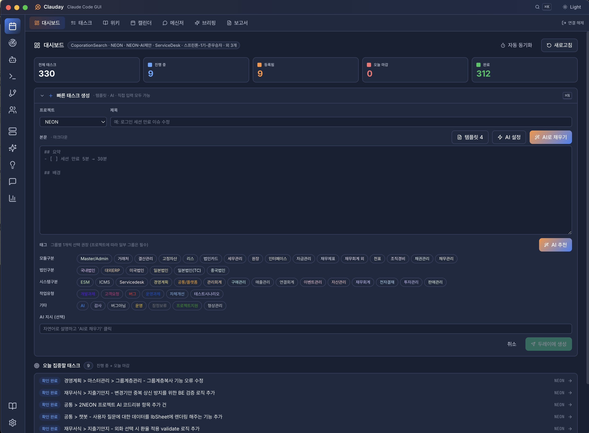

## 이게 뭐예요

- 🤖 **두레이 채팅에서 `@clauday` 한 번이면, 봇이 알아서 일을 시작합니다.**
- ⚡ **메신저 와처가 실시간 모드로 돌아갑니다.** 코드리뷰 요청·멘션을 다시는 놓치지 않습니다.
- 💬 **Claude Code를 채팅 UI로 씁니다.** TUI 안 보고도 스킬·MCP 다 됩니다. 이전 세션은 클릭 한 번에 그대로 이어집니다.
- 📦 **잘 만든 스킬·MCP는 팀 위키에 자동 공유.** 동료가 만든 설정을 클릭으로 받아옵니다.
- 📊 **두레이(태스크·위키·캘린더·메신저)와 Claude Code가 한 앱.** 매일 하던 반복은 AI가 정리합니다.

> 사내 오픈소스. 같이 쓰고 같이 개선해요. 🙂

---

## 목차

- [주요 기능](#주요-기능)
- [1. 대시보드](#1-대시보드)
- [2. 메신저 와처 (실시간 모드)](#2-메신저-와처-실시간-모드)
- [3. @clauday 에이전트 (두레이 봇 모드)](#3-clauday-에이전트-두레이-봇-모드)
- [4. AI 브리핑](#4-ai-브리핑)
- [5. Claude Code 터미널](#5-claude-code-터미널)
- [6. 브랜치 병렬 작업](#6-브랜치-병렬-작업)
- [7. Claude Code 채팅 (세션 + 채팅 UI)](#7-claude-code-채팅-세션--채팅-ui)
- [8. MCP 서버 관리](#8-mcp-서버-관리)
- [9. Skills 관리](#9-skills-관리)
- [10. 팀 공유 라이브러리 (위키 저장소)](#10-팀-공유-라이브러리-위키-저장소)
- [11. 사용량 대시보드](#11-사용량-대시보드)
- [12. AI 추천](#12-ai-추천)
- [13. 커뮤니티](#13-커뮤니티)
- [기능별 AI 모델 라우팅](#기능별-ai-모델-라우팅)
- [설치 & 개발](#설치--개발)
- [릴리즈](#릴리즈)
- [기여하기](#기여하기)

---

## 주요 기능

| 영역 | 기능 |
|---|---|
| **두레이 통합** | 대시보드 · 메신저 와처(실시간 모드) · `@clauday` 봇 · AI 브리핑 |
| **개발 환경** | Claude Code 터미널 · 브랜치 병렬 워크트리 · Claude Code 채팅 UI |
| **설정/공유** | MCP 서버 GUI · Skills GUI · 팀 공유 위키 저장소 · 사용량 대시보드 |
| **인사이트** | AI 추천 · 커뮤니티 |

---

## 1. 대시보드

> 두레이 들락날락 안 해도, 오늘 뭐 할지가 한 화면에 정해집니다.


- 프로젝트별 태스크 통계 — 전체 / 진행 / 등록됨 / 오늘 마감 / 완료
- 자동 동기화
- 좁은 폭에서 stat card 자동 stack (반응형)
- **AI 빠른 태스크 생성** — 프로젝트 + 템플릿 + 한 줄 요청 → 본문/태그 자동 채움
- 태그 그룹 chip + AI 추천 — 필수 태그 누락 방지
- AI 지시문(시스템 프롬프트) 입력란 — "나는 이런 식으로 태스크를 쓴다" 규칙 고정
- 오늘 집중 태스크 목록 — 한 클릭으로 두레이 웹 이동

---

## 2. 메신저 와처 (실시간 모드)

> "코드리뷰 좀 봐주세요" 요청을 채팅 흐름에 묻혀 놓치는 일, 끝내고 싶었습니다.

| 와처 — 리뷰 확인 | 실시간 모드 패널 |
|---|---|
| 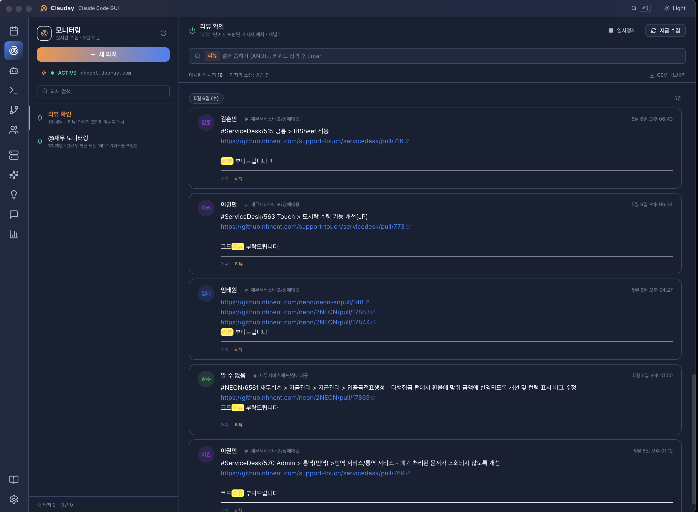 | 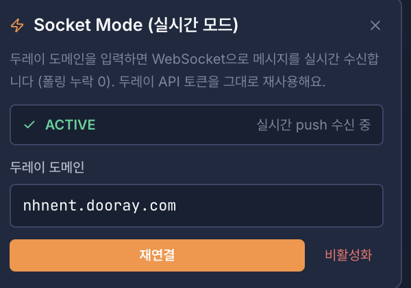 |

- 채팅방 자연어 와처 — `@재무` 같은 비공식 호칭, 코드리뷰 요청, 멘션 추출
- 필터 룰 — 키워드 모두 포함(allOf) + 하나 이상(anyOf) + 정규식 + 제외 조합
- **실시간 모드** — 두레이 도메인만 입력하면 push 수신, 폴링 누락 0
- **폴링과 자동 병행** — 둘 다 켜져도 메시지 해시 기반 중복 제거로 한 번만 쌓임
- 누락 진단 로그 — 최신 5건 샘플, 본문 추출 실패, thread vs 일반 분포 기록
- 3일 보관 후 자동 정리, 매칭 용어 추적, CSV 내보내기
- 두레이 API 토큰 그대로 재사용, 끊기면 한 번에 재연결

---

## 3. @clauday 에이전트 (두레이 봇 모드)

> v1.4 · **앱을 안 띄운 동료도 두레이 채팅에서 `@clauday` 한 번이면 일이 굴러갑니다.**
> 팀에 Clauday 사용자 한 명만 있으면 채팅방 전체가 혜택을 봅니다.

| 메신저에서 호출 | 봇 응답 | 코드리뷰 케이스 |
|---|---|---|
| 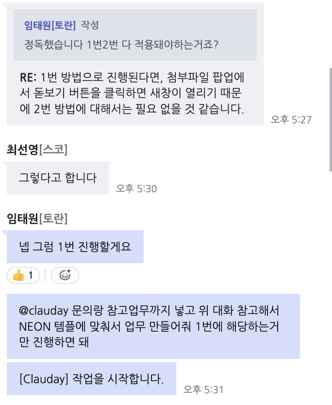 | 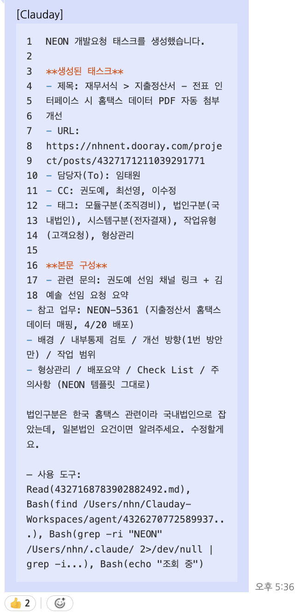 | 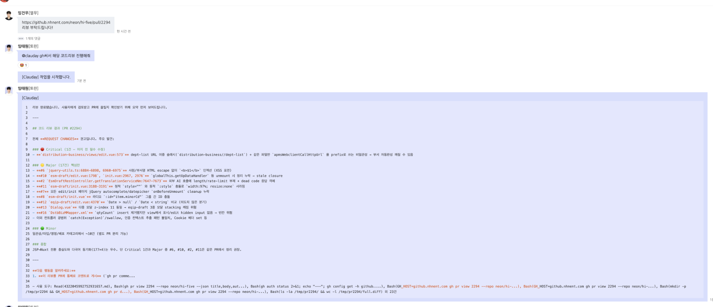 |

- 두레이 채팅방에서 `@clauday` 멘션 → `[Clauday] 작업을 시작합니다.` 응답
- **맨 앞 멘션만 인식** — 한 줄 첫 토큰일 때만 트리거. 본문 중간 멘션은 무시(오발화 방지)
- **본인 토큰 멘션만 처리** — 다른 사람이 내 봇을 트리거 못 걸게
- 채널별 작업물 자동 분리 — `~/Clauday-Workspaces/agent/{channelId}/`
- **컨텍스트 자동 수집** — 멘션 직전 최대 50개 메시지를 시간 오름차순으로 정렬해서 주입
- 첨부 위키 / 태스크 / PR 링크는 본문 파싱 후 함께 인입
- 멘션 본문은 파일로 저장하고 터미널에는 경로만 — 긴 한국어 + 코드 붙여넣기 호환성 회피
- 결과는 같은 채팅방 답글 + 앱 좌측 채널 풀 트랜스크립트
- PR diff 리뷰 / 매뉴얼 조사 / 태스크 자동 생성 / 회식 장소 추천 등 채팅 흐름 그대로 프롬프트화

---

## 4. AI 브리핑

> 아침에 한 번 돌리면, 오늘 무슨 일을 해야 하는지가 정해집니다.

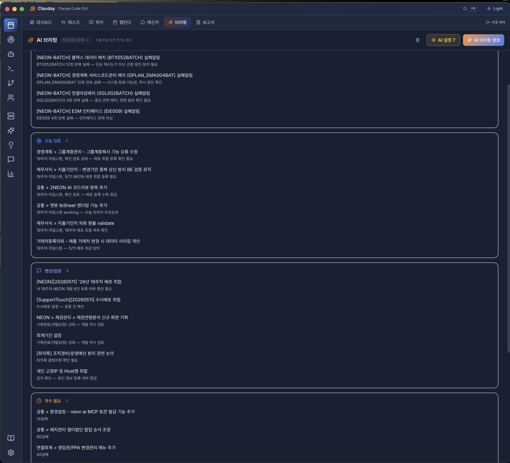

- 한 화면에 모음 — 알림 / 오늘 집중 / 변경사항 / 주요 일정
- **6가지 자동 분류** — 긴급(마감 임박/오류/오래된 working) · 오늘 집중(working or 오늘 마감) · 멘션됨(CC 진행 중) · 착수 필요(3일 이상 등록만) · 일정 · AI 추천
- 데이터 소스 — 담당 태스크 / CC 태스크 / 주간 일정 (각 30~50개 압축 입력)
- 일일 / 주간 보고서 형식도 같은 화면에서 토글
- 로컬 파일 저장 — 지난 브리핑 다시 보기
- 데이터가 비면 스킬에 MCP 호출 권한 위임 — 외부 소스에서 직접 긁기

---

## 5. Claude Code 터미널

> 앱 안에서 그냥 돌아갑니다. 한글 안 깨지고, 재시작해도 화면 안 깨집니다.

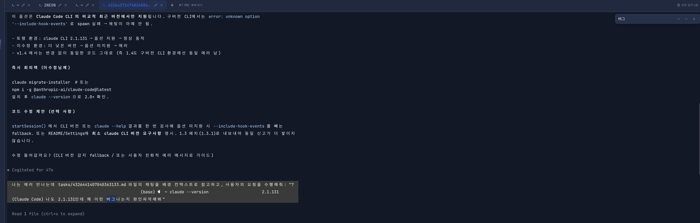

- 폴더 선택 / 다중 탭 (<kbd>Cmd</kbd>+<kbd>T</kbd>, <kbd>Cmd</kbd>+<kbd>W</kbd>)
- 일반 쉘 탭으로도 사용 가능 — Claude Code 전용 아님
- **터미널 내장 검색** (<kbd>Cmd</kbd>+<kbd>F</kbd>)
- **로그인 셸로 실행** — `.zprofile` / `.bash_profile` 자동 로드, NVM / Homebrew 환경 그대로
- 한글 IME 셀 폭 정확히 계산 (Unicode 11 + 한글 폰트 fallback)
- 패키징 앱에서도 `LANG=ko_KR.UTF-8` 강제 — 한글 깨짐 방지
- 세션 이름 영속화 — 탭 이름 변경 후 재시작에도 유지
- 재시작 시 alt-screen TUI 잔재 / 미완성 ANSI 시퀀스 자동 트림 — 화면 깨짐 정리

---

## 6. 브랜치 병렬 작업

> 리팩터 돌리면서 동시에 다른 브랜치에서 버그픽스. 한 앱에서.

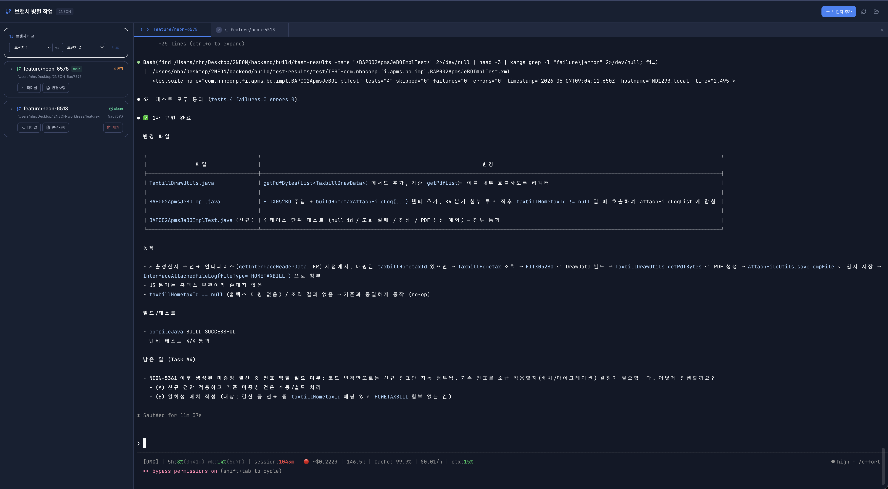

- 브랜치당 워크트리 자동 분리
- 동시 세션 · 진행 상태 모니터링
- 좌측 워크트리 리스트, 상단 탭으로 세션 전환

---

## 7. Claude Code 채팅 (세션 + 채팅 UI)

> **TUI 안 봐도, 채팅 UI에서 Claude Code 그대로 씁니다.** 이전 세션 클릭 → 그 자리에서 이어서 대화.

| 세션 사이드바 + 채팅창 | `/` 입력 → 보유 스킬 팔레트 |
|---|---|
| 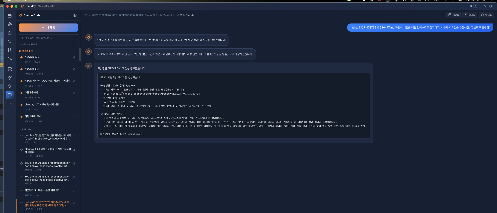 | 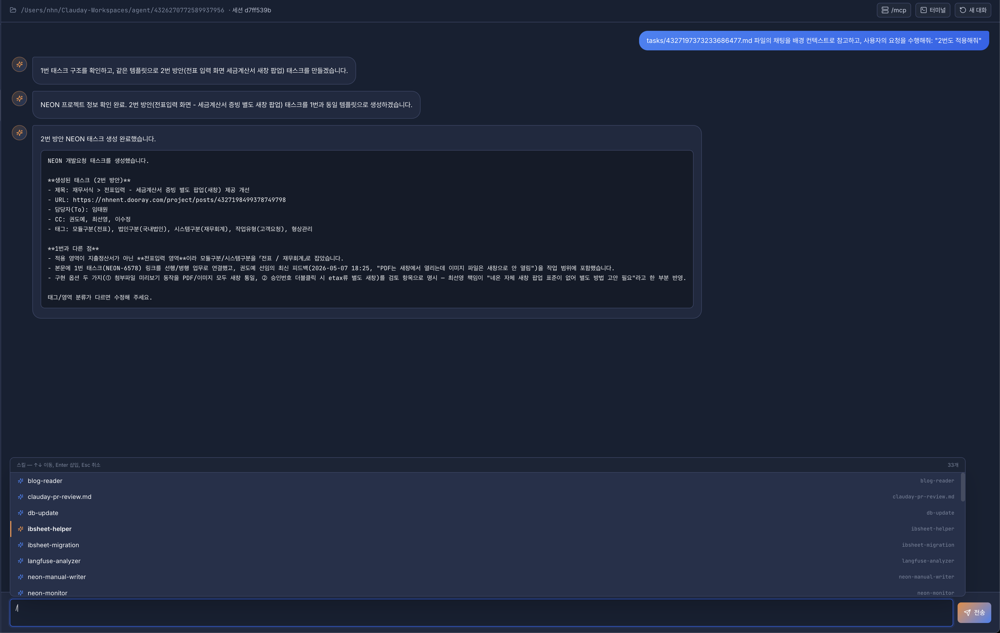 |

- **이전 세션 클릭 → 그대로 이어서 대화** — 별도 명령어 입력 없이 마지막 컨텍스트에서 resume
- 좌측 사이드바 — 새 채팅 / 이전 세션 검색 (제목·작업폴더·세션ID 매칭) / 별표 / 이름 변경
- 사이드바 접기/펴기 — 화면 좁을 때 채팅창 풀폭
- **AI 요약** — 세션 처음 10개 메시지를 Haiku로 3~5줄 요약, 무엇이었는지 한눈에
- `claude -r {sessionId}` **resume 명령어 클립보드 복사** — 외부 터미널에서 그대로 이어가기
- **권한 다이얼로그 자동 통과** — MCP / 스킬 호출이 멈추지 않고 끝까지 진행
- 캐시 토큰 별도 표시 — cache_read / cache_creation 분리, 다음 turn 비용 미리 보기
- 진행 상태 실시간 — `수집 중 → 생각 중 → 응답 중 → 파싱 → 완료` 단계별 표시
- **`/` 입력 → 보유 스킬 자동완성 팔레트** — 첫 줄 첫 글자가 `/` 일 때만 동작 (멀티라인 중간엔 비활성)
- 스킬 선택 시 `/{skillName} ` 만 삽입 — 본문은 자동 주입, 사용자는 자연어 이어서 입력

---

## 8. MCP 서버 관리

> JSON 들여쓰기 맞추다가 env 빠뜨리는 일, 더는 없습니다.

| 로컬 (내 서버) | 공유 탭 |
|---|---|
| 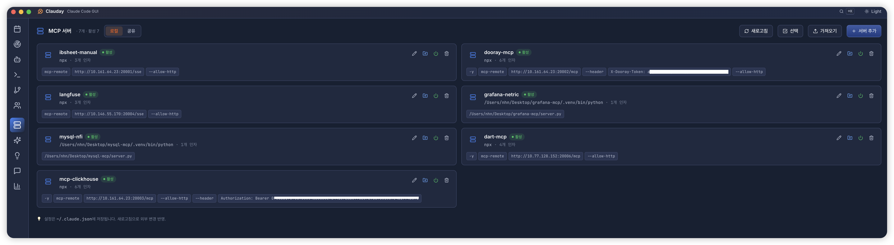 | 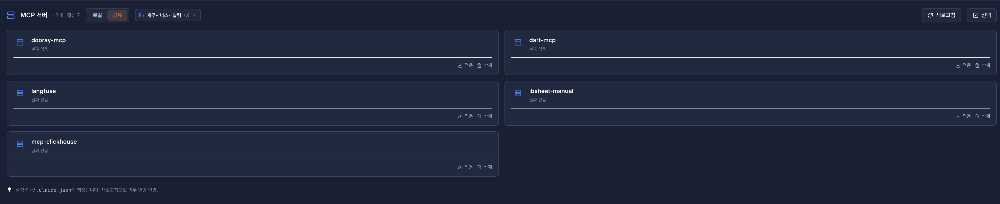 |

- 서버 추가 / 토글 / 편집 GUI — JSON indent 직접 맞출 일 없음
- 경로·env·인자 입력 폼
- **활성/비활성 토글이 실제로 동작** — 비활성 항목은 별도 보관함으로 격리, Claude Code가 안 띄움
- 다중 선택 + 일괄 삭제 / 내보내기 / 공유
- JSON 파일 다중 import — `mcpServers` 형식 또는 단순 객체 둘 다 허용
- **공유 탭** — 다른 사용자가 올린 MCP 받아오기 ([#10 위키 저장소](#10-팀-공유-라이브러리-위키-저장소) 참고)

---

## 9. Skills 관리

> 자연어로 설명하면 AI가 스킬을 만들어 줍니다. 잘된 건 팀이랑 같이 씁니다.

| 내 스킬 | 공유 탭 |
|---|---|
| 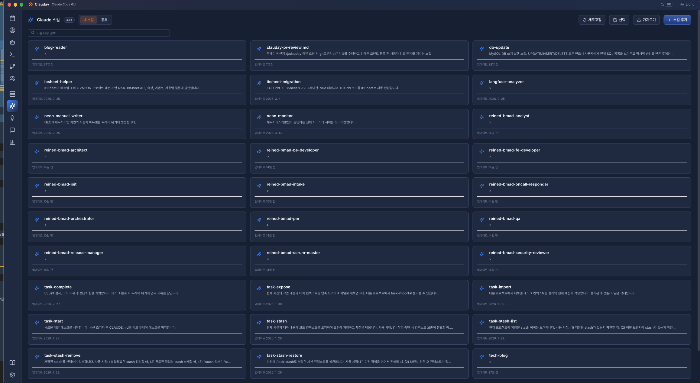 | 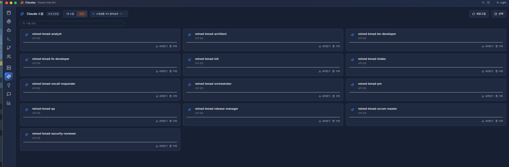 |

- 내 스킬 + 팀 공유 + 공식 스킬 한 곳에서
- AI 생성 GUI — 자연어 설명만으로 스킬 초안 자동 작성
- 다중 선택 + 일괄 삭제 / 내보내기 / 공유 / 내려받기
- **마크다운 미리보기 토글** — 편집 / 미리보기 한 클릭
- **임포트/내보내기 평탄화** — `{name}/SKILL.md` 폴더 ↔ 단일 `.md` 파일 자동 변환
- 채팅창 / 터미널 양쪽에서 `/` 입력 → 보유 스킬 자동완성 팔레트로 즉시 호출

---

## 10. 팀 공유 라이브러리 (위키 저장소)

> **두레이 위키 URL 하나만 등록하면, 그 위키가 우리 팀 전용 스킬·MCP 라이브러리가 됩니다.**
>
> 풀은 두 종류 — ① Clauday 사용자 전체 공유 ② 팀 위키 저장소

| 위키 저장소 드롭다운 | 위키 추가 / 검색 |
|---|---|
| 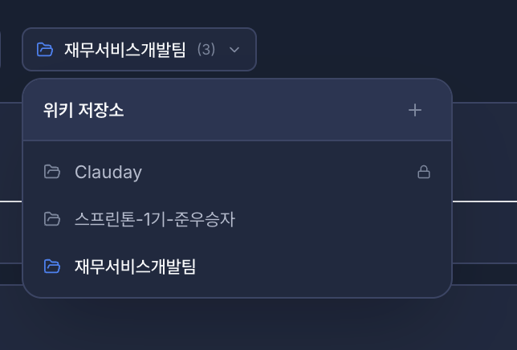 | 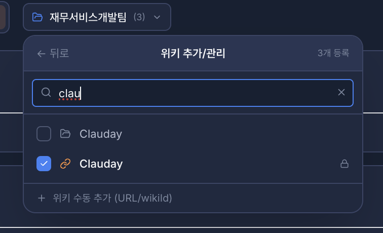 |

- 두레이 위키 URL 등록 → 위키 root 하위에 **`Clauday Skills` / `Clauday MCPs` 컨테이너 자동 생성**
- 위키 URL의 페이지 ID를 그대로 parent 로 사용 — 첫 업로드 때부터 정확히 그 위치에 들어감
- 여러 위키 등록 후 드롭다운으로 전환
- 검색 · 다중 선택 · URL/wikiId 수동 추가
- 컨테이너 ID 캐싱 — 매번 위키 다시 뒤지지 않음
- 충돌 처리 — 동명 항목 덮어쓰기 / 이름 변경 / skip 선택

---

## 11. 사용량 대시보드

> "이번 달 얼마 썼지" — 한 장에 끝.

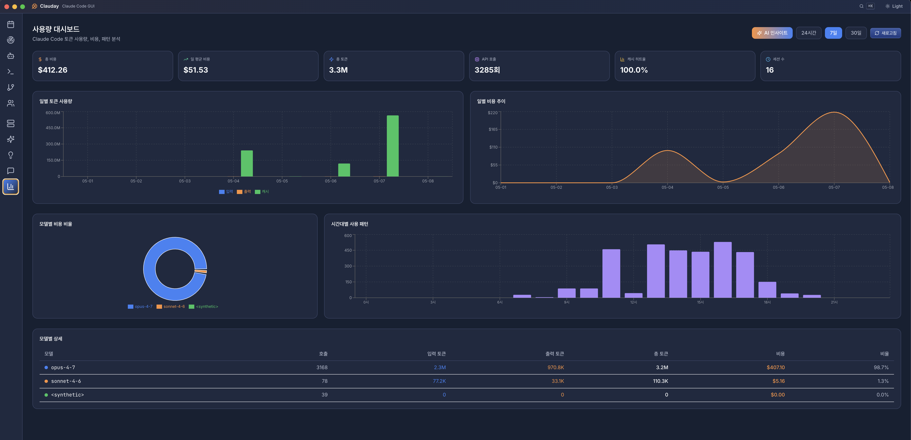

- 총 비용 / 일 평균 / 총 토큰 / API 호출 / 캐시 히트율 / 활성 일수
- 일별 토큰 사용량, 일별 비용 추이, 모델별 비용 비율 (Opus / Sonnet / Synthetic)
- 시간별 사용 패턴 — 피크 시간대 자동 식별
- 24시간 / 7일 / 30일 기간 토글
- 기능별(브리핑·보고서·위키·세션) 호출 횟수·응답 시간·👍/👎 피드백 집계
- 사용 안 하는 기능 자동 탐지 → AI 추천에 컨텍스트로 전달

---

## 12. AI 추천

> 사내에서 누가 좋은 패턴 올렸을 때, **내가 지금 쓰면 좋은 것만** 골라 줍니다.

| 추천 목록 (글 읽기) | AI 분석 결과 |
|---|---|
| 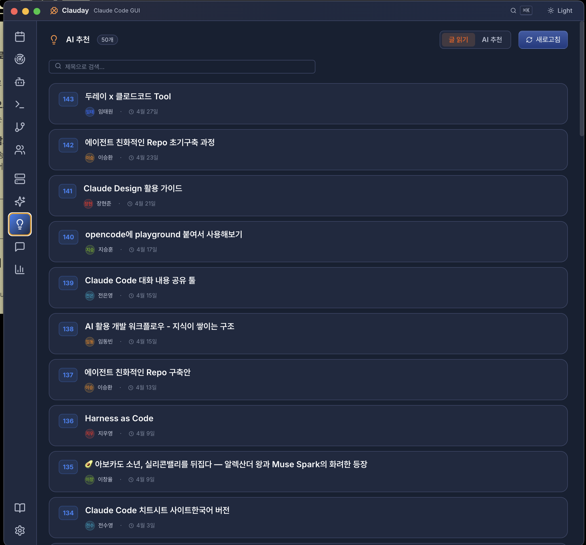 | 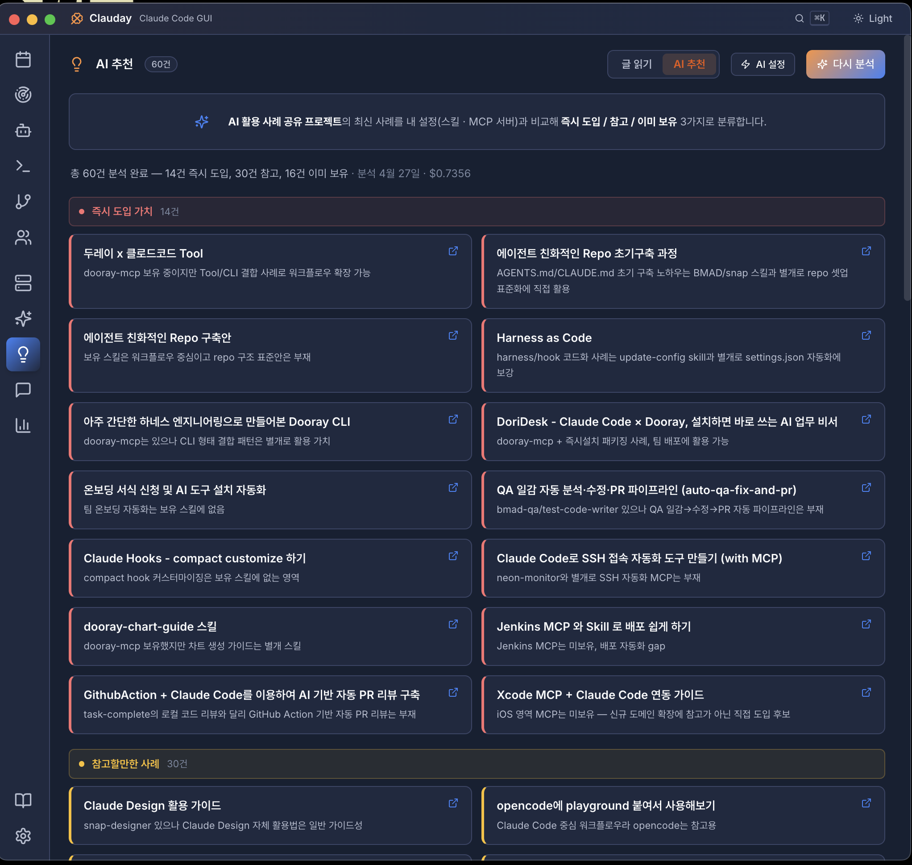 |

- 사내 AI 공유 프로젝트 게시글을 컨텍스트로 흡수
- **글 읽기** — 게시글 원문 그대로 열람
- **AI 추천** — 내 환경(보유 스킬·MCP·기술 스택)과 비교 후 분류
  - **즉시 도입 가치 있음** — 지금 바로 받아서 쓸 수 있는 패턴
  - **참고할만한 사례** — 비슷한 컨텍스트지만 직접 적용은 보류
  - **이미 보유** — 회사가 같은 기능 이미 구축
- "다시 분석" 버튼으로 컨텍스트 새로 반영해서 재분류

---

## 13. 커뮤니티

> 사용자끼리 같이 디벨롭. 남의 설정 보고 배우는 게 제일 빨라요.

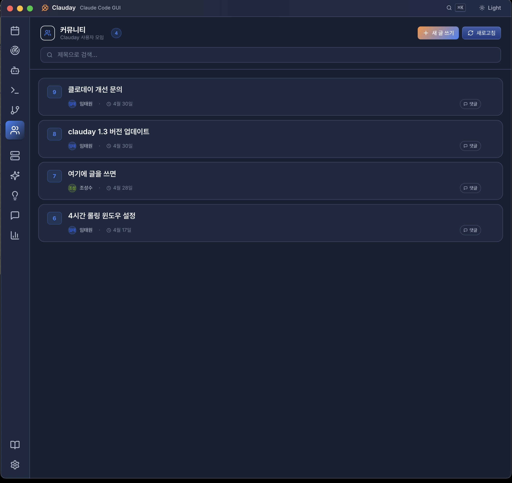

- Clauday 사용자 모임 — 글 / 댓글
- 개선 문의, 버전 업데이트 공지, 자유 글
- 제목 검색

---

## 기능별 AI 모델 라우팅

| 기능 | 용도 | 모델 |
|---|---|---|
| 메신저 요약 · 빠른 태스크 생성 · 세션 요약 | 짧은 문장, 제목·태그 자동 채우기 | **Haiku** |
| AI 브리핑 · 위키 분석 · 메신저 작성 | 여러 소스 통합, 구조화된 결과물 | **Sonnet** |
| AI 추천 · Claude Code 설계 / 리팩터링 | 복잡한 설계·추론 | **Opus** |

설정에서 기능별로 변경 가능합니다.

---

## 설치 & 개발

**요구사항** — Node.js 20+ / Python 3.11 (node-gyp 호환) / macOS · Windows / Claude Code CLI 로그인 상태

```bash
npm install
npm run dev
```

```bash
npm run dist       # macOS dmg
npm run dist:win   # Windows exe
npm run dist:all   # macOS + Windows
```

빌드 결과물은 `release/` 디렉터리에 생성됩니다.

---

## 릴리즈

태그 푸시 트리거. main 머지만으로는 릴리즈가 나가지 않습니다.

```bash
git tag v1.2.3
git push origin v1.2.3
```

`.github/workflows/release.yml` 이 돌면서 macOS(dmg, zip) / Windows(exe) 빌드 → GitHub Release 자동 업로드 + 릴리즈 노트 자동 생성.

수동 실행: GitHub → Actions → Release → **Run workflow**.

> Apple Developer 인증서 시크릿(`MAC_CSC_LINK`, `APPLE_ID` 등)이 등록되어 있으면 자동 서명, 없으면 unsigned dmg.

---

## 기여하기

이슈 / PR 환영합니다. 사내 사용자 모임은 앱 안의 [#13 커뮤니티](#13-커뮤니티) 탭에서.
