<div align="center">

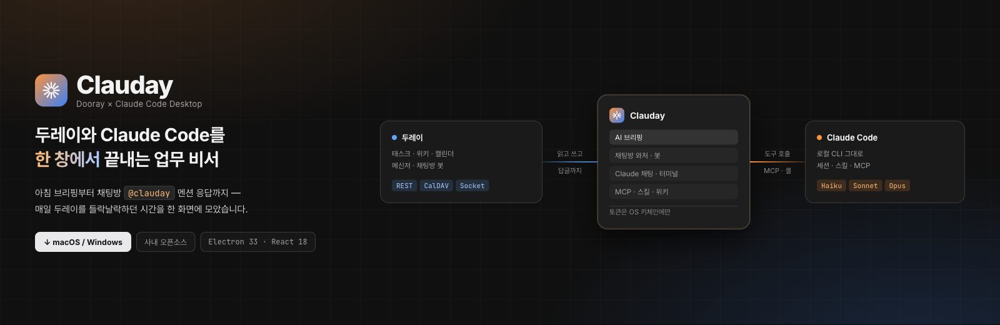

**두레이와 Claude Code 를 한 창에서 끝내는 업무 비서**

아침 브리핑부터 채팅방 `@clauday` 멘션 응답까지 — 매일 두레이를 들락날락하던 시간을 한 화면에 모았습니다.

[](https://github.com/limtaewon/dooray-claude-gui-assistance/releases/latest)

[핵심 기능](#핵심-기능) · [설치](#설치--다운로드) · [개발자용](#개발자용) · [기여하기](#기여하기)

</div>

> 사내 오픈소스입니다. 안 써본 사람도 와서 깔아보고, 별로면 끄세요. 좋으면 같이 디벨롭해요. 🙂

---

## 이런 분에게 잘 맞아요

| | 페인 포인트 | Clauday 가 해주는 것 |
|---|---|---|
| 🔔 **알림 자주 놓치는 사람** | "코드리뷰 좀 봐주세요" 가 채팅 흐름에 묻혀서 사라짐 | 채팅방 와처가 자연어 룰로 잡아내고, `@clauday` 멘션은 봇이 바로 응답까지 |
| 🐣 **Claude Code 입문자** | CLI 부담스럽고 MCP/스킬 설정이 JSON 지옥 | 채팅 UI, 토글 한 번으로 MCP/스킬 ON/OFF, 이전 세션 클릭으로 resume |
| ☕ **아침마다 두레이 정리하는 사람** | 태스크·캘린더·멘션·PR 상태를 매번 일일이 확인 | AI 브리핑 한 번이면 한 화면. 외부 시스템(PR/CI)까지 직접 조회해서 본문에 인용 |
| 🤝 **팀에서 AI 설정 공유하는 사람** | 좋은 스킬/MCP 를 두레이에 글로 올려도 동료가 받아 쓰기 번거로움 | 팀 위키 한 곳이 우리 팀 AI 라이브러리. 클릭으로 올리고 클릭으로 내려받기 |

---

## 어떻게 붙어 있나

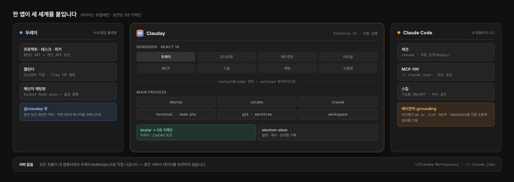

**중간 서버가 없습니다.** 모든 호출이 내 컴퓨터에서 두레이·Anthropic 으로 직접 나갑니다.
토큰은 OS 키체인(keytar)에, 설정·캐시는 `electron-store` 에, 작업 폴더는 `~/Clauday-Workspaces/` 에 — 전부 로컬입니다.

---

## 핵심 기능

### 1. 두레이 채팅방에서 `@clauday` 한 번이면

> **앱을 안 띄운 동료도 채팅방에서 멘션 한 줄로 AI 를 부릅니다.**

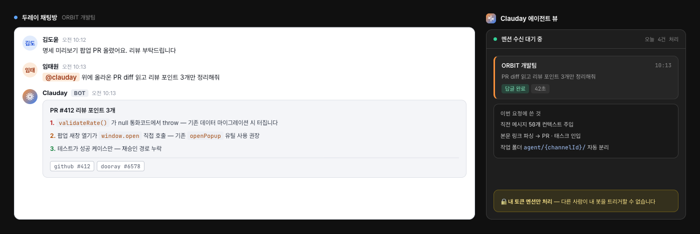

- 채팅방에서 `@clauday {지시}` → 봇이 같은 방에 답글로 응답
- **본인 토큰 멘션만 처리** — 다른 사람이 내 봇을 트리거할 수 없습니다
- 멘션 직전 최대 50개 메시지를 자동 수집해 컨텍스트로 주입
- 위키 / 태스크 / PR 첨부 링크도 본문 파싱 후 같이 인입
- 채널별 작업 폴더 자동 분리 (`~/Clauday-Workspaces/agent/{channelId}/`)
- 팀에 Clauday 사용자가 한 명만 있어도 채팅방 전체가 혜택을 받습니다

**언제 좋냐면** — 채팅 흐름을 끊고 다른 도구를 꺼내기 싫을 때, "이 PR 한 번만 봐줘" 같은 단발성 요청을 그 자리에서 처리하고 싶을 때.

---

### 2. 아침 한 잔 마시는 동안 오늘 할 일이 정리됩니다

> **두레이 + 외부 시스템(PR/CI/배포)까지 한 번에 fetch 해서 브리핑.**

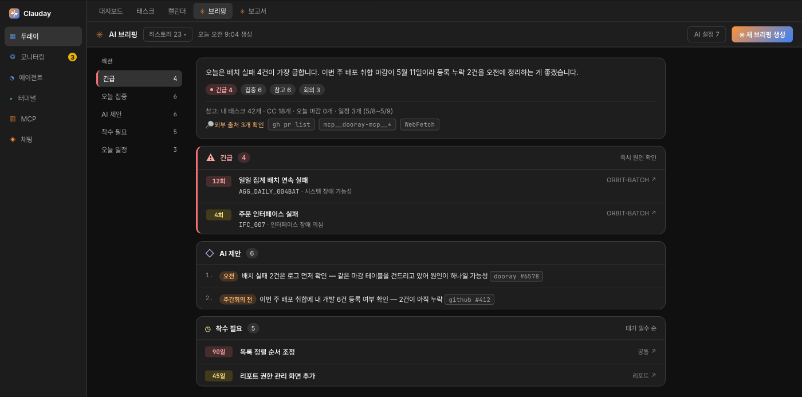

- **6가지 자동 분류** — 긴급 / 오늘 집중 / AI 제안 / 착수 필요 / 오늘 일정 / 참고사항
- **에이전틱 grounding** — 캘린더 일정과 todo 키워드를 보고 사용자 스킬을 따라
  `gh pr list` 같은 셸 명령, `mcp__dooray-mcp__*` 같은 MCP 도구, `WebSearch` / `WebFetch` 까지
  LLM 이 직접 호출해 결과를 본문에 인용합니다
- 본문 URL 은 호스트별 칩으로 자동 링크화 (`nhnent #1234`, `github org/repo`)
- 확인한 외부 출처는 `🔎 외부 출처 N개 확인` 으로 펼쳐 볼 수 있습니다
- **섹션이 여럿이면 왼쪽에 목차** — 「긴급」만 붉은 레일이 붙어 무엇이 급한지 한눈에
- 「착수 필요」의 대기 일수는 60일↑ 빨강 / 30일↑ 노랑으로 얼마나 묵었는지 보여줍니다
- 일일 / 주간 보고서도 같은 에이전틱 파이프라인

**언제 좋냐면** — 아침에 두레이 탭 다섯 개를 돌며 컨텍스트를 다시 끌어올리는 시간을 줄이고 싶을 때.

---

### 3. Claude Code 가 채팅처럼 깔끔해집니다

> **이전 세션 클릭 → 그대로 이어서 대화. TUI 안 봐도 스킬·MCP 다 됩니다.**

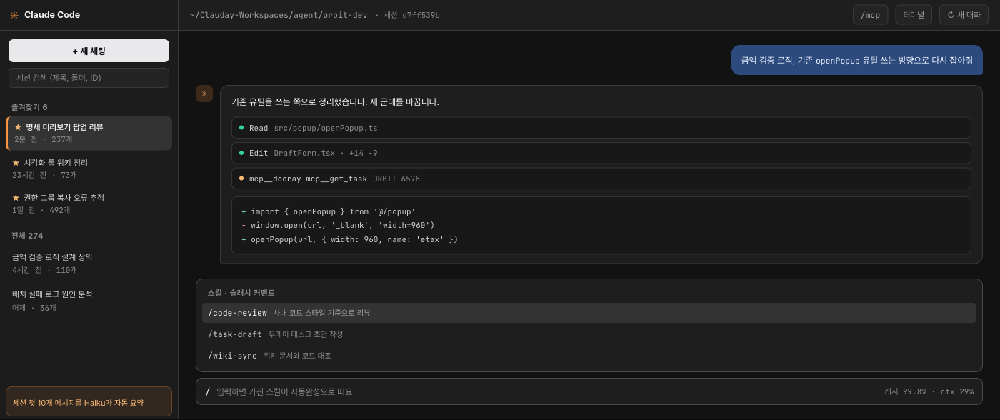

- **이전 세션 그대로 이어서** — `claude -r` 을 외울 필요 없이 좌측에서 클릭
- **AI 요약** — 세션 첫 10개 메시지를 자동 요약(Haiku). 어떤 세션인지 한눈에
- **`/` 입력하면 스킬 자동완성 팔레트** — 가진 스킬을 골라 슬래시 커맨드로 삽입
- **권한 다이얼로그 자동 통과** — MCP·스킬 호출이 중간에 멈추지 않습니다
- 캐시 토큰·컨텍스트 사용률을 하단에 표시 — 다음 turn 비용 미리 보기

**언제 좋냐면** — CLI 의 `/resume` 으로 세션 찾기가 어려울 때, 채팅 UI 가 익숙한 입문자.

---

### 4. 한글이 안 깨지는 터미널 + 브랜치별 워크트리

> **로그인 셸 그대로. 브랜치마다 작업 폴더가 자동으로 갈립니다.**

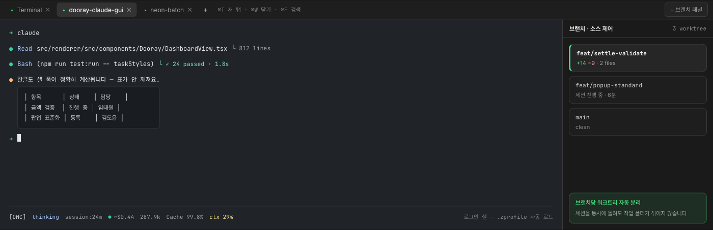

- 다중 탭 <kbd>⌘T</kbd> / 닫기 <kbd>⌘W</kbd> / 검색 <kbd>⌘F</kbd>
- 로그인 셸로 실행 — `.zprofile` / `.bash_profile` 자동 로드
- **한글 IME 셀 폭을 정확히 계산**(Unicode 11) — 표가 안 깨집니다
- 일반 셸로도 씁니다. Claude Code 전용이 아닙니다
- 브랜치당 워크트리 자동 분리 — 세션을 동시에 돌려도 작업 폴더가 섞이지 않습니다
- 우측 패널에서 변경사항·히스토리·브랜치를 그대로 확인

---

### 5. 두레이 업무 카드를 터미널에 끌어다 놓으면

> **워크트리 생성 → `claude` 실행 → 태스크 본문·댓글을 첫 지시로 주입까지 한 번에.**

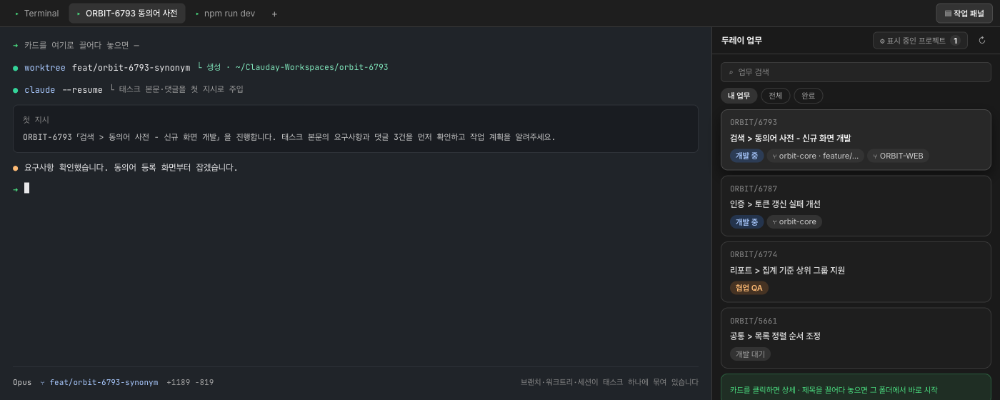

- 업무 카드를 pane 에 **드래그&드롭** — 그 태스크 전용 워크트리에서 바로 시작
- 태스크 본문과 댓글을 첫 지시로 자동 주입
- 태스크 ↔ 세션이 자동으로 묶여, 다음에 열면 `claude --resume` 으로 이어집니다
- 카드를 클릭하면 상세, 제목을 끌면 작업 시작 — 같은 카드로 두 가지

---

### 6. 두레이 캘린더가 진짜 캘린더처럼

> **CalDAV 자체 동기화 + 구글 캘린더 스타일 월간 뷰.**

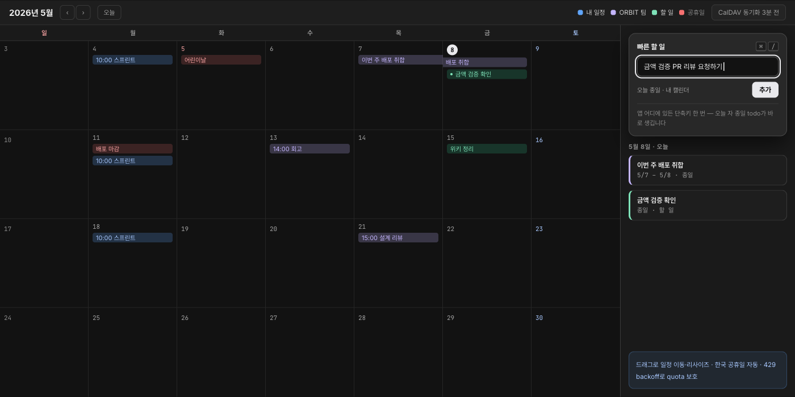

- 두레이 캘린더 토큰 하나로 CalDAV 직결 — 두레이 API 가 안 주는 영역까지 동기화
- **드래그로 일정 이동·리사이즈**, 멀티데이 일정은 막대로 이어서 표시
- **빠른 할 일 한 줄 입력** — 앱 어디에 있든 <kbd>⌘/</kbd> → 오늘 자 종일 todo 즉시 생성
- 표시할 캘린더 토글 + 사용자 지정 색, **한국 공휴일 자동 표시**
- CTag 폴링 3분 주기 + 429 backoff 로 두레이 quota 보호

---

### 7. 팀 위키 하나가 우리 팀 AI 라이브러리가 됩니다

> **위키 URL 등록만 하면 그 안에 스킬/MCP 컨테이너가 자동으로 생깁니다.**

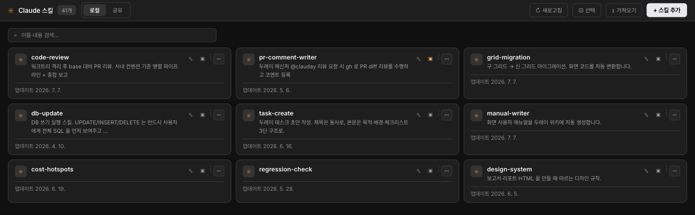

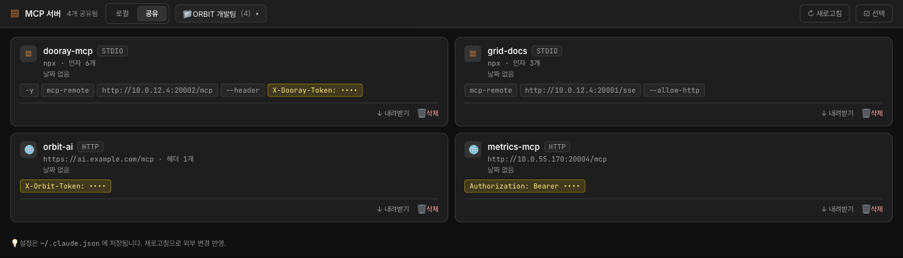

- **로컬 / 공유 두 탭** — 로컬은 내 PC 에 설치된 것(`~/.claude.json`, `~/.claude/skills`),
  공유는 팀이 위키에 올려둔 정의입니다. 공유는 목록일 뿐이라 **내려받기**를 해야 실제로 동작합니다
- 위키 URL 등록 → 그 하위에 `Clauday Skills` / `Clauday MCPs` 컨테이너 자동 생성
- 여러 위키 등록 가능 — 팀 위키 / 개인 위키 / 사내 공통 위키를 나눠 운영
- **다중 선택해서 한 번에** 올리기 / 내려받기 / 삭제
- 활성/비활성 토글이 실제로 동작합니다 — 끈 항목은 별도 보관함으로 옮겨져 Claude Code 가 아예 로드하지 않습니다
- **인자로 넘긴 토큰은 화면에서 가려집니다** — `--header "X-Token: …"` 형태도 값이 새지 않습니다
- 되돌릴 수 없는 삭제는 카드의 `⋯` 메뉴 안에 있습니다

---

### 8. 대시보드 — 조치가 필요한 것만

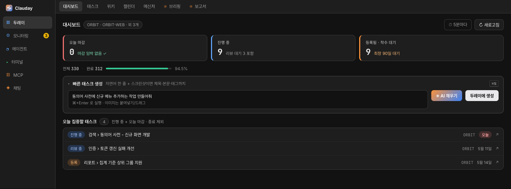

- **오늘 마감 / 진행 중 / 착수 대기** 셋만 카드로. 전체·완료는 진행률 한 줄로 내렸습니다
- 숫자 옆에 해석이 붙습니다 — 「0 · 마감 임박 없음 ✓」처럼, 0 이 좋은 신호인지 아닌지 알 수 있게
- 목록의 **행을 누르면 앱 안에서 상세**가 열립니다. 두레이 원본은 행 끝 `↗` 로 분리
- 자연어 한 줄 + 스크린샷이면 제목·본문·태그까지 AI 가 채웁니다 (<kbd>⌘N</kbd>)
- 자동 동기화 1/5/15/30분 주기

---

## 그 외에도 — 펼쳐보기

<details>
<summary><b>Harness Studio</b> — 에이전트 번들 시각화 & 분석</summary>

- 에이전트 오케스트레이션 번들(reined-bmad, neon-bmad 등) import → 정적 구조 + AI 정규화
- **Flow Canvas** — 에이전트 그래프. L0~L3 레벨 토글, 역할별 노드 색상, 핸드오프 엣지
- **Dry-run** — 태스크 설명을 넣으면 예상 경로·단계 추정
- **Doctor** — AI 없는 정적 정합 검사 (체인 누락, 미정의 에이전트, 고아 산출물, 게이트 불일치)
- **Compare** — 두 번들 비교 (에이전트·레벨·게이트·점수 diff)
- **Export** — HTML 리포트로 다운로드
- 각 필드에 신뢰도 배지 (정적/AI/파생/없음)

</details>

<details>
<summary><b>메신저 와처</b> — 자연어 룰로 채팅방에서 키워드 추출</summary>

- `@재무` 같은 비공식 호칭, 코드리뷰 요청, 멘션 추출
- 필터 룰 — allOf / anyOf / 정규식 / 제외 조합
- **실시간 모드** — 두레이 도메인만 입력하면 push 수신, 폴링 누락 0
- 폴링과 자동 병행, 메시지 해시 기반 중복 제거
- 3일 보관 후 자동 정리, CSV 내보내기

</details>

<details>
<summary><b>기능별 AI 도구 선택</b> — 브리핑/보고서가 어떤 MCP·스킬을 쓸지 결정</summary>

- 기능마다 사용할 MCP 서버 토글 + 사용자 스킬 ON/OFF
- 스킬은 미리보기 / 내보내기 / 가져오기 가능
- 브리핑·보고서·메신저 작성·요약 등을 각각 별도로 구성

</details>

<details>
<summary><b>사용량 대시보드</b> — 이번 달 얼마 썼지</summary>

- 총 비용 / 일 평균 / 총 토큰 / API 호출 / 캐시 히트율 / 활성 일수
- 일별 토큰·비용 추이, 모델별 비율
- 시간별 사용 패턴 — 피크 시간대 자동 식별
- 24h / 7d / 30d 토글
- 기능별 호출 횟수·응답 시간·👍/👎 피드백 집계

</details>

<details>
<summary><b>AI 추천</b> — 사내 AI 공유글 중 지금 내가 쓰면 좋은 것</summary>

- 사내 AI 공유 프로젝트 게시글 흡수
- 내 환경(스킬·MCP·기술 스택)과 비교해 **즉시 도입 가치 있음 / 참고할만한 사례 / 이미 보유** 로 분류

</details>

<details>
<summary><b>커뮤니티 · 오류 리포트</b></summary>

- **커뮤니티** — 글/댓글/제목 검색. 개선 문의, 버전 공지, 자유 글
- **오류 리포트** — AI 호출 실패 시 토스트의 🐞 버튼. 진단 정보(Claude CLI 버전, 호출 인자, stdout/stderr 앞부분)를 자동 수집해
  커뮤니티 채널에 게시하거나 클립보드로 복사합니다

</details>

<details>
<summary><b>탐색 / 단축키</b></summary>

| 단축키 | 동작 |
|---|---|
| <kbd>⌘K</kbd> 또는 <kbd>Shift</kbd>×2 | 커맨드 팔레트 (IntelliJ Search Everywhere 패턴) |
| <kbd>⌘/</kbd> | 빠른 할 일 추가 |
| <kbd>⌘N</kbd> | 빠른 태스크 생성 |
| <kbd>⌘T</kbd> / <kbd>⌘W</kbd> | 터미널 새 탭 / 닫기 |
| <kbd>⌘F</kbd> | 터미널 검색 |
| <kbd>⌘E</kbd> | 최근 뷰 |

- 팔레트에서 두레이 sub-tab 직행 — `두레이 — 대시보드 / 태스크 / 위키 / 캘린더 / 메신저 / AI 브리핑 / AI 보고서`
- 사이드바 항목 순서·노출 커스텀 (설정 → 외관 & 동작)

</details>

---

## 기능별 AI 모델 라우팅

| 기능 | 용도 | 모델 |
|---|---|---|
| 메신저 요약 · 빠른 태스크 생성 · 세션 요약 | 짧은 문장, 자동 채우기 | **Haiku** |
| AI 브리핑 · 위키 분석 · 메신저 작성 | 여러 소스 통합, 구조화 | **Sonnet** |
| AI 추천 · Claude Code 설계 / 리팩터링 | 복잡한 설계·추론 | **Opus** |

설정에서 기능별로 바꿀 수 있습니다.

---

## 설치 / 다운로드

[GitHub Releases](https://github.com/limtaewon/dooray-claude-gui-assistance/releases/latest) 에서 OS 에 맞는 파일을 받으세요.

| OS | 파일 |
|---|---|
| macOS (Apple Silicon) | `Clauday-{버전}-arm64.dmg` |
| Windows | `Clauday Setup {버전}.exe` |

### 처음 켤 때 — 두 가지만 준비

1. **Claude Code CLI 로그인 상태** — 터미널에서 `claude` 를 한 번 실행해 로그인해 두세요
2. **두레이 API 토큰** — 두레이 → [개인 설정 → API 토큰](https://nhnent.dooray.com/setting/api/token) 에서 발급
   - 캘린더까지 쓰려면 **CalDAV 토큰** 도 같이 발급

앱 첫 실행 시 토큰 입력 화면에서 한 번 넣으면 끝입니다 (OS 키체인 보관).

### 업데이트

앱을 켜면 새 버전이 있는지 확인하고, 있을 때만 타이틀바에 버튼이 나타납니다.

| OS | 동작 |
|---|---|
| **Windows** | 배경으로 내려받고, 「재시작하고 설치」를 누르면 재시작하며 설치까지 끝냅니다 |
| **macOS** | 새 버전을 알리고 dmg 를 받아 Finder 에서 열어줍니다 — 드래그는 직접 하셔야 합니다 |

> macOS 가 반쪽인 건 서명 때문입니다. 자동 설치를 담당하는 Squirrel.Mac 은 새 앱 번들의 서명이 지금 실행 중인
> 앱과 같은 주체인지 검사하는데, 현재 빌드는 ad-hoc 서명이라 통과하지 못합니다. Apple Developer ID 를 붙이면
> Windows 와 같아집니다.

업데이트 확인이 실패해도(오프라인·사내망 차단) 앱 사용에는 영향이 없습니다.

### macOS 실행 차단 해제

서명 미적용 빌드라 첫 실행 시 차단될 수 있습니다.

1. Clauday 실행 → 차단 대화상자에서 **확인**
2. 시스템 설정 → 개인정보 보호 및 보안
3. 맨 아래 "Clauday 차단됨" 안내 옆 **그래도 열기**
4. 패스워드 입력 후 다시 실행

---

## 개발자용

```bash
npm install     # postinstall 에서 node-pty / keytar 자동 리빌드
npm run dev     # electron-vite dev
npm run build
npm run test:run
```

```bash
npm run dist       # macOS dmg
npm run dist:win   # Windows exe
npm run dist:all   # macOS + Windows
npm run icons      # build/icon.svg → icns / ico 재생성
```

빌드 결과물은 `release/`.

### 릴리즈

태그 푸시가 트리거입니다. main 머지만으로는 릴리즈되지 않습니다.

```bash
git tag v2.0.4
git push origin v2.0.4
```

**Windows — 자동.** `.github/workflows/release.yml` 이 exe 를 빌드하고 `latest.yml` 과 함께 Release 에 첨부합니다.

> `latest.yml` 은 앱 안의 자동 업데이트가 "최신 버전이 무엇인지" 읽는 메타파일입니다.
> 이게 빠지면 exe 가 올라가도 **기존 사용자는 새 버전을 영영 못 받습니다.**

**macOS — 수동.** Apple Developer 인증서가 없어 GitHub Actions 의 macOS runner 에서 codesign 이 실패합니다.
매 릴리즈마다 로컬 Mac 에서:

```bash
git fetch --tags && git checkout v<버전>
npm install
npm run dist
gh release upload v<버전> release/*.dmg
```

---

## 기여하기

이슈 / PR 환영합니다. 앱 안의 **커뮤니티** 탭에서도 사내 사용자 모임이 진행 중이에요.

- 서드파티 이식 코드의 라이선스 고지는 [`THIRD-PARTY-NOTICES.md`](THIRD-PARTY-NOTICES.md) 참조
- 코딩 규칙·디자인 토큰은 [`CLAUDE.md`](CLAUDE.md) 와 [`docs/design-system/`](docs/design-system/) 에 정리돼 있습니다
- 버전별 변경 이력은 [`CHANGELOG.md`](CHANGELOG.md)

버그를 발견하면 — AI 호출 실패는 토스트의 🐞 **오류 리포트** 버튼이 진단 정보를 자동 수집해 한 번에 제보해 줍니다.
